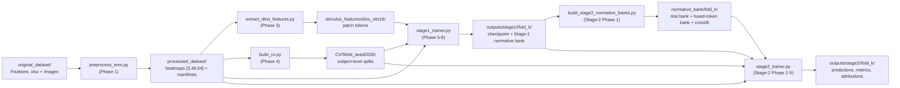
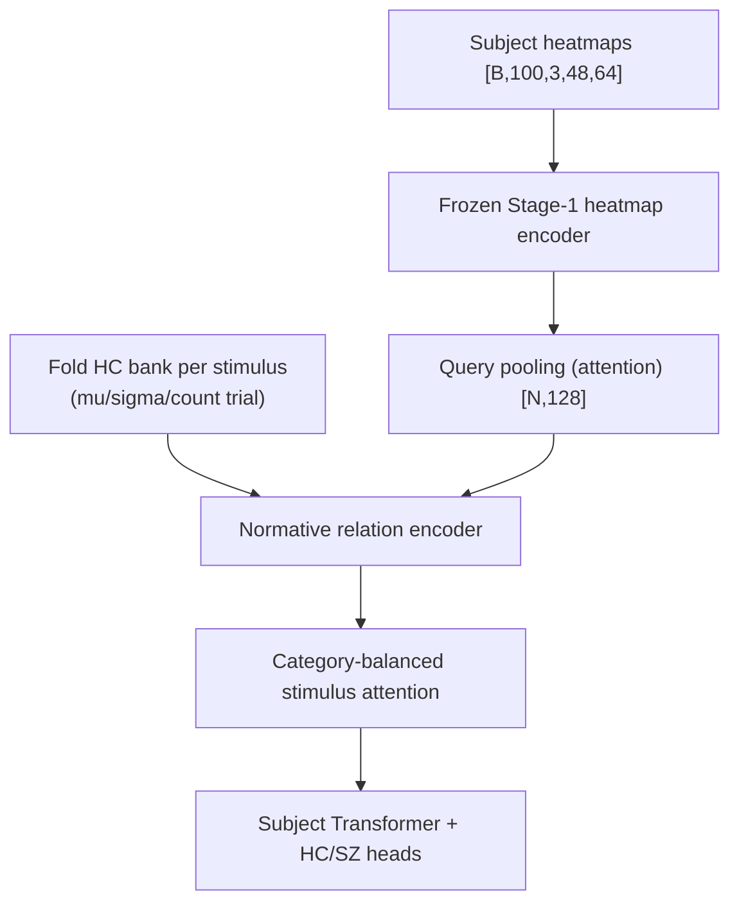

# EMS Project — Eye-movement analysis pipeline from preprocessing to HC/SZ diagnosis

> **Language:** 🇬🇧 English | 🇻🇳 [Tiếng Việt](README.md)

This repository implements the research pipeline **eye-movement (fixation) → heatmap → normative representation → diagnostic classification** on the EMS dataset (Healthy Control **HC** vs Schizophrenia **SZ**). The full pipeline has 3 major stages:

1. **Preprocessing & data preparation** — turns raw fixation events into standardized 3-channel heatmaps, extracts stimulus image features with frozen DINO, and builds a 5-fold subject-level CV split.
2. **Stage-1** — trains an **HC-only semantic-conditioned normative encoder**: each HC trial is encoded as a 128-d embedding that reconstructs its masked heatmap (masked reconstruction) while staying consistent across healthy viewers (leave-one-out cosine consistency). Output: per-fold checkpoints + per-stimulus **normative banks**.
3. **Stage-2** — uses the frozen Stage-1 encoder + normative bank to **classify subjects as HC/SZ**, with the **subject** (not the trial) as the classification unit.

Detailed per-stage documentation lives in `readme/`:

| Document | Contents |
|---|---|
| [`readme/preprocessed/README.md`](readme/preprocessed/README.md) | Processed dataset schema, exact 3-channel definitions, population & QC statistics, descriptive EDA |
| [`readme/Stage1/README.md`](readme/Stage1/README.md) | Stage-1 architecture, losses, training schedule, best-checkpoint policy, normative bank |
| [`readme/Stage2/README.md`](readme/Stage2/README.md) | Stage-2 architecture, ablation table, commands, leakage safeguards, troubleshooting |

> **Note:** the 3 documents above are *static artifacts* — the auto-generator scripts were removed on request, so after code/config changes they must be updated manually. This README is the consolidated overview; every figure below is taken from the existing code/config (no speculation).

Phase-by-phase implementation guides (for development, with per-phase contracts) live in `docs/claude-stage1-guide/` and `docs/claude-stage2-guide/`.

---

## 1. Data overview

### 1.1 Original Dataset (never modified)

```
original_dataset/EMS/
├── All_Data/Fixations/     # 1 .xlsx workbook per subject, sheet "Free_viewing"
└── Images/                 # 100 stimulus images 1024×768, in 4 categories:
    ├── Manipulated Images  (32 images)
    ├── Natural Scenes      (31 images)
    ├── Social Scenes       (22 images)
    └── Synthetic Images    (15 images)
```

- Each fixation row contains: `IMAGE`, `FIX_INDEX` (fixation order), `FIX_DURATION` (ms), `FIX_X`, `FIX_Y` (coordinates on the 1024×768 canvas), `FIX_PUPIL` (kept for QC only).
- **No timestamps or raw gaze samples exist** — fixation order and duration are the only temporal information.
- **Diagnostic label** (dataset rule): subject numeric ID **< 200 → HC (0)**, **≥ 200 → SZ (1)** (`label_rule: numeric_id_below_split_is_hc`, `hc_sz_split: 200` in `configs/preprocessing.yaml`).

### 1.2 Processed Dataset — `processed_dataset/`

A **deterministic cache** for all downstream stages (DINO, CV, Stage-1, Stage-2). It contains **no** fitted model, no CV statistics, no normative bank and no population normalization — preprocessing operates on individual trials only.

```
processed_dataset/
├── dataset_metadata.json         # completion record (written last; readers require it)
├── preprocessing_config.json     # fully resolved configuration
├── source_inventory.json         # SHA-256 image/subject inventory + anomaly measurements
├── image_manifest.csv            # stimulus_index, stimulus_id, category, path, size, sha256
├── subject_manifest.csv          # subject_id, group, label, source_workbook, n_trials, ...
├── trial_manifest.parquet/.csv   # 1 row/trial: trial_uid, subject_id, stimulus_id, QC metrics...
├── qc_summary.json               # global QC counts + excluded-trial list
└── subjects/<subject_id>/        # ID keeps leading zeros ("000", "203")
    ├── heatmaps.npy              # float32 [n_trials, 3, 48, 64]
    ├── stimulus_indices.npy      # int64 [n_trials], ascending stimulus_index order
    ├── trial_qc.parquet          # per-trial QC
    └── artifact_meta.json        # config hash, source checksum, array checksums
```

**Identifier rules:** `subject_id` = workbook stem with leading zeros preserved; `stimulus_index` = contiguous integer assigned only through `image_manifest.csv` (ordered by category, then basename); trial key = `(subject_id, stimulus_id)` with a SHA-256-derived `trial_uid`. Array access must go through manifests — **never use ID magnitude as an offset**.

### 1.3 Population statistics (measured from the actual artifacts)

- **160 subjects**: 80 HC / 80 SZ
- **100 stimuli** (32 / 31 / 22 / 15 by category)
- **225,159 fixation rows**; **15,912 observed trials** (15,907 heatmap-eligible, 5 excluded for having no valid spatial fixations)
- Trials per subject: min 63, max 100, mean 99.5; **12 subjects with missing stimuli** (most incomplete: `216` with 63 trials, `259` with 68 trials)
- Fixations per trial: min 1, median 14.0, max 39

### 1.4 Exact 3-channel heatmap definitions

Every heatmap is `float32 [3, 48, 64]` with this **immutable** channel order:

| Channel | Content | Stored range |
|---|---|---|
| 0 | **Fixation density** — sum of unit-mass Gaussians (σ = 2.0 cells, truncated at 4σ, border-truncated kernels renormalized to unit sum) | ≥ 0, mass ≈ number of used fixations |
| 1 | **Transition density** — each consecutive fixation pair (original `FIX_INDEX` order, both endpoints spatially valid) is rasterized with step ≤ 0.5 cells, normalized to unit mass, then Gaussian-smoothed | ≥ 0, mass ≈ number of used transitions |
| 2 | **Temporal progression τ** — clock reconstructed from fixation durations: τᵢ = 2·tᵢᵐⁱᵈ − 1 with tᵢᵐⁱᵈ = (Σ_{k<i} d_k + dᵢ/2)/Σ_k d_k; H_P = Σᵢ τᵢGᵢ/(H_F+ε) | ≈ [−1, 1] |

Fixation coordinate transform from the 1024×768 canvas: `u = x·(W−1)/(1024−1)`, `v = y·(H−1)/(768−1)` with `W=64, H=48`.

**Event filtering policy:** off-canvas fixations are dropped from spatial maps (policy `drop`) but keep their QC counts; fixations with duration ≤ 0 are dropped (`min_fix_duration_ms=0.0`, `drop_nonpositive_duration=true`); trials with no usable spatial fixation get `qc_status="excluded_no_spatial_fixations"` and **no heatmap row**. Rejected fixations are never bridged when rasterizing transitions.

---

## 2. Environment

- Python **3.12** (`.python-version`), package management via **uv** (`pyproject.toml`, `uv.lock`, `.venv/`).
- Main dependencies: `torch>=2.3`, `torchvision>=0.18`, `numpy`, `pandas`, `pyarrow`, `openpyxl`, `pillow`, `scikit-learn`, `scipy`, `matplotlib`, `pyyaml`.

```bash
cd /root/EMS-Project
uv sync                        # creates .venv with the exact uv.lock versions
source .venv/bin/activate
```

Root scripts insert `src/` into `sys.path` themselves, so no package install is needed; modules live in `src/{preprocessing, stimulus_extraction, cv, stage1, stage2}`.

---

## 3. Project phases overview

The project was built following two phase-guide sets (`docs/claude-stage1-guide/` for data preparation + Stage-1; `docs/claude-stage2-guide/` for Stage-2). Each phase has its own contract, gate and artifact:

| Stage | Phase | Content | Main script/module | Artifact |
|---|---|---|---|---|
| Data | 0 | Audit & architecture decisions (Stage-1) | — | `docs/claude-stage1-guide/` |
| Data | 1 | Preprocessing fixation → heatmap | `preprocess_ems.py` | `processed_dataset/` |
| Data | 2 | Descriptive EDA (HC/SZ, 1 value/subject) | `src/preprocessing/eda.py` | `readme/preprocessed/` (figures, EDA summary) |
| Data | 3 | Frozen DINO ViT-S/16 feature extraction | `extract_dino_features.py` | `stimulus_features/dino_vits16/` |
| Data | 4 | 5-fold subject-level CV split (stratified) | `build_cv.py` | `CV/5fold_seed2026/` |
| Stage-1 | 5 | HC-normative encoder implementation + training | `stage1_trainer.py` | `outputs/stage1/<run>/fold_k/` |
| Stage-1 | 6 | Trainer, ablations, documentation | `stage1_trainer.py --ablation` | `configs/stage1/ablations/` |
| Stage-1 | 7 | QA & handoff | — | tests, README |
| Stage-2 | 0 | Audit & 5 decisions A–E | — | `configs/stage2/stage1_checkpoints.yaml` |
| Stage-2 | 1 | Build 5-fold normative banks (trial + fused-token, 4-way crossfit) | `build_stage2_normative_banks.py` | `normative_bank/fold_*/` |
| Stage-2 | 2 | Subject dataset & dataloader | `src/stage2/dataset.py` | — |
| Stage-2 | 3 | Model & losses | `src/stage2/model.py`, `losses.py` | — |
| Stage-2 | 4 | Ablation framework | `src/stage2/ablations.py` | `configs/stage2/ablations/` |
| Stage-2 | 5 | Trainer, validation, logging | `stage2_trainer.py` | `outputs/stage2/<run>/fold_k/` |
| Stage-2 | 6 | README & QA handoff | — | `readme/Stage2/README.md` |

**Approved Stage-2 Phase-0 decisions:**

| Decision | Choice | Meaning |
|---|---|---|
| **A — evaluation regime** | **A1** `pilot_existing_stage1` | Reuse the 5 existing Stage-1 checkpoints (SHA-pinned). All outer-fold results are labeled `outer_fold_exploratory` — **not** a strict held-out estimate. `strict_nested_stage1` was rejected because no per-fold internally-selected Stage-1 checkpoints exist. |
| **B — bank contents** | **B2** trial + fused-token bank | `mu/sigma/count_trial [100,128]` + `mu/sigma_token [100,192,128]`. No heatmap-token bank is built. |
| **C — self-inclusion** | **C1** four-way crossfit | A training subject never receives a bank built from its own trials. |
| **D — encoder policy** | **D1** frozen Stage-1 heatmap encoder | Only the `unfreeze_last_block` ablation trains the final residual block (lr ×0.1 + anchor loss). |
| **E — base model** | **E1** trial-bank primary model | Token attention is an ablation (`token_bank_serial_attention`), not the base. |

---

## 4. Overall architecture

### 4.1 End-to-end pipeline



### 4.2 Stage-1 — HC-only semantic-conditioned normative encoder

Stage-1 trains **exclusively on HC trials** of the current fold (SZ rows are filtered out at the dataset boundary). There is no VICReg, no contrastive loss (InfoNCE/SupCon), no SZ classification loss and no diagnostic classifier anywhere.

```text
heatmap [N,3,48,64]
  -> Conv2d(3,128,k=4,s=4) -> GN+GELU -> [N,192,128]   # heatmap encoder (192 tokens on a 12×16 grid)
  -> masked-token replacement -> fixed 2-D sincos positions
  -> 2 residual blocks                                   H0
  -> cross-attention 1 (Q=H0, K/V=adapted DINO) + gamma_1 residual      H1
  -> spatial NN bridge (LN -> 128->256 GELU -> dwconv 3x3 -> GN+GELU -> 256->128) + eta residual  M
  -> cross-attention 2 (Q=M, K/V=same adapted DINO) + gamma_2 residual  H2
  -> LayerNorm                                            Z  [N,192,128]
  -> decoder (ConvT(128,64,k4,s4) -> res block -> 1x1 -> 3 ch)   # reconstructs the 3 channels
  -> attention pooling (softmax(w2^T tanh(W1 z_j)))        z  [N,128]
```

- **DINO adapter:** each stimulus image (deterministic resize to 512×384) passes through frozen DINO ViT-S/16, yielding patch tokens `[768, 384]` on the 24×32 grid → reshape `[384,24,32]` → `DepthwiseConv2d(384,384,k=2,s=2)` → `Conv2d(384,128,k=1)` → `[128,12,16]` → `[192,128]`. Both branches produce an exactly aligned 12×16 grid (1 DINO patch = 2×2 heatmap cells; the adapter aggregates 2×2 DINO patches; the heatmap encoder aggregates 4×4 cells).
- The two cross-attentions have **fully independent parameters** and share only the same adapted DINO K/V tensor. The canonical order `Attention 1 → spatial bridge → Attention 2` is immutable in the base config.
- Residual gates are initialized as `gamma_1 = gamma_2 = 0.1/2`, `eta = 0.1` (learned by default).
- **Total parameters: 617,479** (all trainable).

**Losses:**

```text
L_rec   = sum_c w_c * mean_{masked pixels} SmoothL1(recon_c, target_c)   # 3 channels, weights [1,1,1]
mu_{-h,s} = (1/(H-1)) sum_{h' != h} z_{h',s}                              # stop-grad centroid
L_norm  = (1/N) sum_{h,s} [1 - cos(z_{h,s}, sg(mu_{-h,s}))]               # leave-one-out
L_stage1 = L_rec + lambda_norm * L_norm (+ dispersion-floor hinge on stimulus centroids:
           lambda_spread=5.0, spread_floor=0.1 — prevents collapse-to-mean)
```

**Training schedule (50 epochs):**

| Phase | Epochs | Content |
|---|---|---|
| Phase A | 0–9 | Reconstruction warm-up, `lambda_norm = 0` |
| Phase B | 10–14 | Linear ramp of `lambda_norm` up to 0.1 |
| Phase C | 15–49 | Full objective |

Only epochs **≥ 15** are eligible for best checkpoint (`best_eligible_after_norm_ramp=true`); the model selection metric is `val_loss` (same `lambda_norm` as training; each loss component is logged separately).

### 4.3 Stage-2 — HC-normative diagnostic subject classification

Stage-2 does **not** run DINO or Stage-1 semantic fusion for the subject being predicted: the query path uses only the frozen Stage-1 heatmap encoder (base), while the normative bank is a precomputed Stage-1 artifact. Because the Stage-1 trial embedding is **post-fusion** while the Stage-2 query comes from the **pre-fusion** heatmap encoder, all comparisons go through learned projections — raw subtraction between query and bank is never presented as same-space evidence.



**Tensor flow (base, trial bank):**

1. Each trial's heatmap passes through the frozen encoder → heat tokens `[N,192,128]` → learned query pooling → `q0 [N,128]`.
2. **Normative relation encoder** (`src/stage2/relation.py`):
   - `QueryProjection`: `LayerNorm → Linear(128,128)` → `q`.
   - `BankMeanAdapter`: `LayerNorm → Linear(128,128)` over the matched stimulus `mu` → `n_mu`.
   - `BankSigmaAdapter`: `concat(LayerNorm(log σ), log count) [129] → Linear(129,256) → GELU → Linear(256,128)` → `uncertainty_context`.
   - `ReliabilityHead`: `[mean(−log σ), log count] → MLP → sigmoid` → `rho ∈ (0,1)`.
   - Relation feature vector **[770]** = concat of `q, n_mu, uncertainty_context, q−n_mu, |q−n_mu|, q⊙n_mu, cos(q,n_mu), rho` (6×128 + 2) → MLP `Linear(770,256) → GELU → Dropout → Linear(256,128)` + query-projection shortcut → LayerNorm → `z_trial [N,128]`.
3. Scatter `z_trial` into the panel `[B,100,128]` with a missing mask (missing trials are excluded from every softmax/loss).
4. **Category-balanced stimulus attention** `[B,100]` — stimulus selection weights, balanced per category so image-heavy categories do not dominate.
5. **Subject Transformer** (1 layer, FFN 256) → subject embedding `[B,128]`.
6. Two parallel heads: the main head (BCE) and the **auxiliary evidence head** — trained to predict from additive per-stimulus evidence, supervised by `L_aux`.

**Stage-2 losses:**

| Component | Level | Purpose | Base weight |
|---|---|---|---|
| `L_cls` | subject `[B]` | main subject BCE | 1.0 |
| `L_aux` | subject `[B]` | BCE for the additive-evidence head | 0.3 |
| `L_trialmatch` | HC trials | matched query ↔ bank alignment | 0.1 (shared `lambda_match`) |
| `L_bankrank` | HC trials | matched vs wrong-stimulus margin | 0.1 (shared `lambda_match`) |
| `L_cons` | subject | prediction consistency across stimulus subsets | 0.1 |
| `L_ent` | subject | early attention-collapse regularizer | 0.01 |
| `L_anchor` | encoder params | Stage-1 weight anchoring (unfreeze ablation only) | 0.0 |

```text
L_total = L_cls + 0.3·L_aux + 0.1·L_match + 0.1·L_cons + 0.01·L_ent + λ_anchor·L_anchor
```

**Stage-2 training schedule:**

1. **Phase 2A** — HC-only bank alignment warm-up (10 epochs, `L_match` only, **never** eligible for best);
2. **Phase 2B** — HC/SZ diagnostic training (50 epochs, full objective);
3. (optional) fine-tune the encoder's last block — only in the `unfreeze_last_block` ablation;
4. **Calibration** from non-test predictions (`validation.calibrate: true`).

**Ordered best-epoch rule:** `val_balanced_accuracy` → `val_auroc` → lower `val_loss` → earlier epoch. Early stopping patience 10. When a fold has only one class, AUROC/balanced accuracy are stored as `null` with a warning — never substituted with zero.

**Stage-2 normative bank** (built by `build_stage2_normative_banks.py`, config `configs/stage2/bank.yaml`):

- Per outer fold: load the unique registry Stage-1 checkpoint (SHA-256 pinned) → use **training-HC contributors only** → full unmasked Stage-1 inference → group by `stimulus_index` → accumulate means and diagonal variances (float64).
- Files: `mu_trial [100,128]`, `sigma_trial [100,128]`, `count_trial [100]`, `mu_token/sigma_token [100,192,128]`, `feature_manifest.csv`, `metadata.json`, `audit.json` + a `crossfit/` directory (4-way: each training subject uses a bank whose HC contributor subset excludes the subject's own split).
- `estimator: mean`, `epsilon: 1e-6` (variance clamp), `min_samples: 2` (stimuli with < 2 contributors are flagged), `batch_size: 64`.
- After building, it **verifies** that no held-out subject contributed to its fold's bank.

---

## 5. Running the pipeline in order

All commands run from the repo root. The root `.py` files are thin CLIs; all logic lives in `src/`.

### Step 1 — Preprocessing (Phase 1)

```bash
# Dry-run: inventory + validate, write nothing
python preprocess_ems.py --config configs/preprocessing.yaml --dry-run

# Full run → processed_dataset/
python preprocess_ems.py --config configs/preprocessing.yaml

# Re-run only changed subjects / force overwrite
python preprocess_ems.py --config configs/preprocessing.yaml --resume
python preprocess_ems.py --config configs/preprocessing.yaml --force

# Smoke test with a few subjects (requires a separate --output-root, never writes to the canonical dataset)
python preprocess_ems.py --config configs/preprocessing.yaml --subjects 000 001 \
  --output-root /tmp/preprocess_smoke
```

### Step 2 — EDA (Phase 2, optional)

EDA is a set of functions in `src/preprocessing/eda.py` (e.g. `compute_eda_summary(processed_root, command)`); every group comparison aggregates to **1 value per subject** before any statistic is computed. `readme/preprocessed/` (figures + `eda_summary.json`) is a static artifact generated earlier.

### Step 3 — DINO feature extraction (Phase 3)

```bash
python extract_dino_features.py \
  --config configs/dino_vits16.yaml \
  --image-manifest /root/EMS-Project/processed_dataset/image_manifest.csv \
  --output-root /root/EMS-Project/stimulus_features

# Verify existing artifact / continue / overwrite
python extract_dino_features.py --config configs/dino_vits16.yaml --verify-only
python extract_dino_features.py --config configs/dino_vits16.yaml --resume
python extract_dino_features.py --config configs/dino_vits16.yaml --force

# Smoke test
python extract_dino_features.py --config configs/dino_vits16.yaml \
  --stimulus-limit 3 --output-root /tmp/dino_smoke
```

Output: `stimulus_features/dino_vits16/{patch_tokens.npy, feature_manifest.csv, validation_report.json, extraction_config.json, model_metadata.json}`.

### Step 4 — 5-fold CV split (Phase 4)

```bash
python build_cv.py \
  --config configs/cv_5fold.yaml \
  --subject-manifest /root/EMS-Project/processed_dataset/subject_manifest.csv \
  --trial-manifest /root/EMS-Project/processed_dataset/trial_manifest.parquet \
  --output-root /root/EMS-Project/CV

python build_cv.py --config configs/cv_5fold.yaml ... --verify-only
```

Output: `CV/5fold_seed2026/` with `fold_<k>/{train_subjects.csv, val_subjects.csv, train_trials.parquet, val_trials.parquet}` + `cv_config.json`, `cv_metadata.json`, `validation_report.json`. **The subject is the independent unit** — validation subjects never appear in their fold's training; Stage-1 consumes only the HC rows of these same partitions.

### Step 5 — Train Stage-1 (Phase 5–6)

```bash
# One fold (0..4) or all folds sequentially with isolated outputs
python stage1_trainer.py --config configs/stage1/base.yaml --fold 0
python stage1_trainer.py --config configs/stage1/base.yaml --fold all

# Smoke test
python stage1_trainer.py --config configs/stage1/base.yaml --fold 0 \
  --max-epochs 2 --max-train-batches 3 --max-val-batches 3 --run-name smoke

# Verify inputs and tensor contracts without optimization
python stage1_trainer.py --config configs/stage1/base.yaml --fold 0 --dry-run

# Exact resume (optimizer/scheduler/RNG restored)
python stage1_trainer.py --resume outputs/stage1/<run>/fold_0/checkpoints/last_stage1_fold0.pt

# Weight-only initialization; fresh optimizer/scheduler/run
python stage1_trainer.py --config configs/stage1/base.yaml --fold 0 \
  --load-stage1-weights outputs/stage1/<run>/fold_0/checkpoints/best_stage1_fold0.pt

# Rebuild the fold's normative bank from the best checkpoint
python stage1_trainer.py --build-norm-bank \
  --checkpoint outputs/stage1/<run>/fold_0/checkpoints/best_stage1_fold0.pt

# Ablation (one primary factor changed relative to base.yaml)
python stage1_trainer.py --config configs/stage1/base.yaml --ablation no_semantic --fold 0
```

Stage-1 ablations: `no_semantic`, `aligned_add_fusion`, `concat_fusion`, `single_cross_attention`, `no_spatial_bridge`, `token_mlp_bridge`, `no_fusion_residual`, `fixed_fusion_gates`, `mean_pooling`, `no_norm_loss`, `full_reconstruction`, `fixation_only`, `no_transition_channel`, `no_temporal_channel`, `avgpool_semantic_adapter`.

Output: `outputs/stage1/<run_id>/` (run metadata + `fold_<k>/` with `history.csv`, `checkpoints/`, `validation/`, `normative_bank/`).

### Step 6 — Build normative banks for Stage-2 (Stage-2 Phase 1)

```bash
# Build all 5 folds following the Stage-1 checkpoint registry
python build_stage2_normative_banks.py \
  --checkpoint-registry configs/stage2/stage1_checkpoints.yaml \
  --config configs/stage2/bank.yaml --fold all

# Read-only verification
python build_stage2_normative_banks.py \
  --checkpoint-registry configs/stage2/stage1_checkpoints.yaml \
  --config configs/stage2/bank.yaml --fold all --verify-only

# Smoke: 1 fold, separate output, no token banks
python build_stage2_normative_banks.py \
  --checkpoint-registry configs/stage2/stage1_checkpoints.yaml \
  --config configs/stage2/bank.yaml --fold 0 --output-root <smoke root> \
  --no-include-fused-token-bank --no-include-heatmap-token-bank
```

Output: `normative_bank/fold_<k>/` as described in §4.3.

### Step 7 — Train Stage-2 (Stage-2 Phase 2–5)

```bash
# Verify-only / dry-run
python stage2_trainer.py --config configs/stage2/base.yaml --fold 0 --verify-only
python stage2_trainer.py --config configs/stage2/base.yaml --fold 0 --dry-run \
  --max-train-subjects 4 --max-val-subjects 4 --max-train-batches 1 --max-val-batches 1

# Explicitly marked smoke run (not an experimental result)
python stage2_trainer.py --config configs/stage2/base.yaml --fold 0 --smoke \
  --max-train-subjects 4 --max-val-subjects 4 --max-train-batches 1 --max-val-batches 1 \
  --override optimization.alignment_epochs=0 --override optimization.classification_epochs=2

# Production training: drop the --max-* flags
python stage2_trainer.py --config configs/stage2/base.yaml --fold 0
python stage2_trainer.py --config configs/stage2/base.yaml --fold all

# Named ablation (registry dry-run exercised for every runnable ablation)
python stage2_trainer.py --config configs/stage2/base.yaml --fold all --ablation no_bank
python -m stage2.ablations --fold 0 --dry-run-all

# Exact resume / weight-only initialization
python stage2_trainer.py --resume outputs/stage2/<run_id>/fold_0/checkpoints/last_stage2_fold0.pt
python stage2_trainer.py --load-stage2-weights outputs/stage2/<run_id>/fold_0/checkpoints/best_stage2_fold0.pt
```

Other useful flags: `--seed`, `--evaluation-regime {pilot_existing_stage1,strict_nested_stage1}` (only the first regime is available — decision A1), `--stage1-checkpoint` (must be byte-identical to the registry, SHA-256), `--bank-root`, `--output-root`, `--device`, `--num-workers`, `--deterministic`, `--override KEY=VALUE` (dotted-key, applied after the ablation overlay, repeatable).

> The limit flags (`--max-*`) are **only valid together with** `--dry-run` or `--smoke`; resume and load-weights are mutually exclusive. Exit codes: 0 ok, 1 usage/config/verify error, 2 training fold failure.

### Step 8 — Tests

```bash
python -m pytest tests/preprocessing -q
python -m pytest tests/stage1 -q
python -m pytest tests/stage2 -q
```

---

## 6. Important training/evaluation steps

### 6.1 Stage-1

- **Masking:** 35% of tokens on the 12×16 grid are masked in both train and validation; the token mask is upsampled by repeating each token over its 4×4 patch; the loss is computed on masked pixels only.
- **Model selection:** only epochs ≥ 15 are eligible (after the norm ramp); metric `val_loss`; patience 10.
- **Post-training normative bank:** from the best checkpoint, **unmasked** inference over all outer-training HC trials → per-stimulus statistics; validation IDs are asserted absent from the bank.
- **history.csv** is durably rewritten after every epoch (~50 columns: phases, eligibility, best, lr, lambda_norm, per-component losses, dispersion, gate values, mask ratios, gradient stats, seed...).

### 6.2 Stage-2

- **The subject is the independent unit** for folds, batching, losses, metrics, bootstrap and CI. One subject = one panel of at most 100 trials (missing trials are masked).
- **Phase 2A** (10 alignment epochs, `L_match` only) is never eligible for best; best is only considered in Phase 2B.
- **Ordered best rule:** `val_balanced_accuracy` → `val_auroc` → `val_loss` → earlier epoch.
- **Calibration:** after training, calibrate from non-test predictions (`validation/calibration.json`).
- **Attribution:** `stimulus_attention` (category-balanced stimulus selection weight), `stimulus_evidence` (signed local HC/SZ evidence), `stimulus_contribution = attention × evidence`, `normative_deviation`, `semantic_compatibility`. These are attribution signals, **not** proof of causal importance; recommended controls: fold/seed stability, leave-one-stimulus-out deletion compared against category-matched random deletion, subject-level bootstrap CI.
- **history.csv** is atomically committed after every epoch (checkpoint → history → `epoch_commit.json`, all atomic + fsync) with ~70 columns (see `readme/Stage2/README.md` §10).

### 6.3 Leakage & reproducibility controls (both stages)

- Subject-level folds; validation subjects never appear in their fold's training.
- Stage-1 trains **only on the fold's HC trials**; any channel statistics (if present) are fitted on training HC only.
- Stage-1 checkpoints/banks are SHA-256 pinned in `configs/stage2/stage1_checkpoints.yaml`; any checksum mismatch **aborts the run** instead of falling back.
- Crossfit banks: a training HC never receives a bank it built itself (`audit/leakage_checks.json`).
- Config hash (key-order invariant) + source checksums are recorded per run.
- Deterministic validation (fixed order, fixed subset masks, inference mode); exact resume restores optimizer/scheduler/scaler/RNG/sampler/best-rule state and is rejected on fold/config/checksum differences.
- `pilot_existing_stage1` outer-fold results are labeled `outer_fold_exploratory` — never reported as a strict hold-out estimate.

---

## 7. Main configuration files explained

### 7.1 `configs/preprocessing.yaml`

| Parameter | Value | Meaning / effect |
|---|---|---|
| `raw_root`, `fixation_root`, `image_root`, `output_root` | paths | Raw data sources and where `processed_dataset/` is written |
| `subject_glob`, `subject_filename_regex` | `*.xlsx`, `^[0-9]+[.]xlsx$` | Only numeric-named workbooks are accepted (subject ID) |
| `sheet_name` | `Free_viewing` | Sheet holding the fixation data in each workbook |
| `columns.*` | `IMAGE, FIX_INDEX, FIX_DURATION, FIX_X, FIX_Y, FIX_PUPIL` | Column name mapping in the sheet |
| `label_rule`, `hc_sz_split` | `numeric_id_below_split_is_hc`, `200` | ID < 200 → HC (0), ≥ 200 → SZ (1) |
| `source_width/height` | 1024/768 | Original canvas for coordinate normalization |
| `heatmap_height/width` | 48/64 | Output heatmap grid |
| `gaussian_sigma_cells` | 2.0 | σ of each fixation's Gaussian (grid cells) — spatial spread of one fixation |
| `gaussian_truncate_sigma` | 4.0 | Truncate the Gaussian at 4σ; border kernels are renormalized to unit mass |
| `transition_sample_step_cells` | 0.5 | Sub-cell step when rasterizing transition segments — smaller is smoother but slower |
| `temporal_epsilon` | 1e-8 | Avoids division by zero when normalizing the temporal channel |
| `off_canvas_policy` | `drop` | Off-canvas fixations are dropped from spatial maps (still counted in QC) |
| `zero_spatial_policy` | `exclude_no_spatial` | Trials with no spatial fixation → `excluded_no_spatial_fixations`, no heatmap |
| `min_fix_duration_ms`, `drop_nonpositive_duration` | 0.0, true | Drop fixations with duration ≤ 0 |
| `dtype`, `seed` | float32, 2026 | Storage dtype and pipeline-wide seed |
| `write_trial_manifest_csv` | true | Also export a human-readable `trial_manifest.csv` |

### 7.2 `configs/dino_vits16.yaml`

| Parameter | Value | Meaning / effect |
|---|---|---|
| `model_name`, `hub_source` | `dino_vits16`, `facebookresearch/dino:main` | Pretrained (ImageNet) DINO ViT-S/16, `frozen: true` — no EMS data ever participates in training |
| `input_height/width`, `resize_mode`, `interpolation` | 384/512, `exact`, bicubic + antialias | Deterministic 1024×768 → 512×384 resize (exact 4:3); no crop, no augmentation |
| `output_layer` | `final_normalized_patch_tokens` | Use normalized patch tokens (no CLS token) |
| `expected_patch_size/grid/token_dim` | 16, [24,32], 384 | Contract asserted at extraction time — a mismatch fails immediately |
| `batch_size`, `device` | 1, cpu | Sequential CPU inference (Phase-0 decision) |

### 7.3 `configs/cv_5fold.yaml`

| Parameter | Value | Meaning / effect |
|---|---|---|
| `n_splits` | 5 | 5 folds, ≈ 32 validation subjects each |
| `shuffle`, `random_state` | true, 2026 | Deterministic shuffle before splitting |
| `stratify_column` | `label` | Balances the HC/SZ ratio across folds |
| `group_column` | `subject_id` | All trials of one subject stay in the same partition (no same-subject trial leakage) |

### 7.4 `configs/stage1/base.yaml`

| Parameter | Value | Meaning / effect |
|---|---|---|
| `model.d_model` | 128 | Common embedding dimension (and token dimension) |
| `model.heatmap_patch_size` | 4 | Each encoder token aggregates 4×4 heatmap cells → 12×16 grid |
| `model.semantic_adapter` | `learned_depthwise_2x2` | How 2×2 DINO patches are aggregated (learned depthwise conv) |
| `model.fusion` | `serial_attention_spatial_attention` | Canonical order of 2 cross-attentions + spatial bridge |
| `model.semantic_gamma_total_init` | 0.1 | Total init of the 2 γ gates (0.05 each) — starts nearly ignoring the semantic branch, then learns it up |
| `model.spatial_bridge_*` | dwconv 3×3, expansion 2.0, η_init 0.1 | Spatial bridge between the attentions; small η = signal-preserving start |
| `model.pooling` | `attention` | Learned attention pooling → 128-d trial embedding |
| `masking.train_mask_ratio` | 0.35 | Token mask ratio — higher = harder task, lower = easier to overfit |
| `loss.lambda_norm` | 0.1 | Consistency-loss weight in the final stage (after the ramp) |
| `loss.norm_start_epoch` / `norm_ramp_epochs` | 10 / 5 | Schedule for ramping the normative loss in |
| `loss.spread_floor` / `lambda_spread` | 0.1 / 5.0 | Anti-collapse-to-mean hinge: penalizes stimulus centroids closer than the floor |
| `sampler.stimuli_per_batch` / `hc_per_stimulus` | 8 / 8 | Each batch: 8 stimuli × 8 HC viewers = 64 trials; reduce on OOM |
| `sampler.min_hc_per_stimulus` | 8 | Stimuli with < 8 available HCs are skipped in the batch (logged) |
| `optimization.epochs` | 50 | Total epochs (10 warmup + 5 ramp + 35 joint) |
| `optimization.learning_rate` | 3e-4 | AdamW base LR (all parameters trainable) |
| `optimization.gradient_clip_norm` | 5.0 | Gradient clipping — guards against non-finite loss |
| `optimization.amp` | true | Automatic Mixed Precision |
| `validation.selection_metric` | `val_loss` | Best-checkpoint selection metric |
| `validation.best_eligible_after_norm_ramp` | true | Warmup/ramp epochs are never compared against full-objective epochs |
| `validation.early_stopping_patience` | 10 | Stop if val does not improve for 10 epochs |
| `runtime.deterministic_validation` | true | Fixed validation order/masks |
| `paths.*` | — | Point to `processed_dataset`, DINO features, `CV/5fold_seed2026/fold_0` (trainer swaps in the other folds), output |

### 7.5 `configs/stage2/base.yaml`

| Parameter | Value | Meaning / effect |
|---|---|---|
| `evaluation_regime` | `pilot_existing_stage1` | Outer fold is exploratory only (decision A1); do not switch to `strict_nested_stage1` with ablations |
| `bank.root`, `bank.train_mode` | `normative_bank/`, `crossfit` | Bank path; training uses crossfit banks (excluding the subject itself) |
| `bank.checkpoint_registry` | `stage1_checkpoints.yaml` | SHA-pinned registry: exactly 1 Stage-1 checkpoint per fold |
| `sampler.subject_batch_size` | 4 | Subjects per batch (each subject up to 100 trials) — reduce on OOM |
| `sampler.balance_groups` | true | Balance HC/SZ within the batch |
| `model.encoder_source` / `freeze_encoder` | `stage1_heatmap_encoder` / true | Transfer the Stage-1 heatmap encoder and freeze it (decision D1) |
| `model.query_pooling` | `attention` | Learned attention pooling over the 192 heat tokens |
| `model.relation_hidden` | 256 | Relation MLP hidden size (770 → 256 → 128) |
| `model.bank_mode` | `trial` | Base uses the trial bank; `token_bank_serial_attention` switches to the fused-token bank |
| `model.category_balanced_attention` | true | Stimulus weights balanced per category |
| `model.subject_transformer_layers` / `ffn` | 1 / 256 | 1 Transformer layer contextualizing across stimuli |
| `model.dropout` | 0.25 | Global dropout |
| `model.auxiliary_evidence_head` | true | Enables the auxiliary additive-evidence head (supervised by `L_aux`) |
| `loss.lambda_aux` | 0.3 | Weight of the auxiliary-head supervision |
| `loss.lambda_match` | 0.1 | Weight of the alignment loss group (trialmatch + bankrank) |
| `loss.lambda_cons` | 0.1 | Consistency across stimulus subsets |
| `loss.lambda_entropy` / `entropy_anneal_epochs` | 0.01 / 10 | Anti early attention-collapse, annealed over the first 10 epochs |
| `loss.lambda_anchor` | 0.0 | Only enabled in the `unfreeze_last_block` ablation |
| `loss.*_margin` | 0.2 | Margins for trialmatch / bankrank / tokenmatch |
| `subsets.enabled` / `min/max_fraction` | true / 0.5–0.8 | Random stimulus subsets (category-preserving) for the consistency loss |
| `optimization.alignment_epochs` | 10 | Phase 2A (`L_match` only, never eligible for best) |
| `optimization.classification_epochs` | 50 | Phase 2B (full objective) |
| `optimization.learning_rate` | 1e-4 | Main LR (new Stage-2 heads) |
| `optimization.encoder_learning_rate` | 1e-5 | Separate encoder LR (used by the unfreeze ablation; ×0.1) |
| `optimization.gradient_clip_norm` | 1.0 | Gradient clipping (tighter than Stage-1) |
| `validation.selection_metric` / `secondary_metric` | `val_balanced_accuracy` / `val_auroc` | Ordered best-selection rule |
| `validation.calibrate` | true | Calibrate after training from non-test predictions |

### 7.6 `configs/stage2/bank.yaml` + `configs/stage2/stage1_checkpoints.yaml`

- `bank.yaml`: `estimator: mean` (float64 mean/diagonal variance), `epsilon: 1e-6` (diagonal-variance clamp), `min_samples: 2` (stimuli need ≥ 2 HC contributors), `batch_size: 64` (bank inference), `include_fused_token_bank: true` / `include_heatmap_token_bank: false` (decision B2), `crossfit_splits: 4` + `crossfit_enabled: true` (decision C1).
- `stage1_checkpoints.yaml`: maps each fold 0–4 to exactly 1 Stage-1 best checkpoint with its SHA-256. The loader **verifies the SHA-256 before any inference**; to change a checkpoint you must deliberately update the registry — the `--stage1-checkpoint` CLI only accepts a file byte-identical to the registry.

### 7.7 Ablation files

- `configs/stage1/ablations/*.yaml` (15 files): each changes **one** factor relative to base (list in Step 5).
- `configs/stage2/ablations/*.yaml` (16 files + base): each ablation declares its scientific question, reference, changed keys, required bank artifact and kind (variant / negative control / token child). Full table — including the 4 negative controls (`no_bank`, `wrong_stimulus_bank`, `global_bank`, `random_encoder`) — in `readme/Stage2/README.md` §11.

---

## 8. Output layout

```
outputs/stage1/<run_id>/
├── run_metadata.json, config_resolved.yaml, environment.json, source_checksums.json
└── fold_<k>/
    ├── history.csv
    ├── checkpoints/{best,last}_stage1_fold<k>.pt
    ├── validation/best_val_embeddings.npz, metrics.json
    └── normative_bank/{mu_trial,sigma_trial,count_trial}.npy, feature_manifest.csv, metadata.json

outputs/stage2/<run_id>/
├── config_resolved.yaml, environment.json, run_metadata.json, source_checksums.json
└── fold_<k>/
    ├── history.csv, epoch_commit.json, train.log
    ├── checkpoints/{best,last}_stage2_fold<k>.pt
    ├── validation/{metrics.json, subject_predictions.parquet, stimulus_attributions.npz, calibration.json}
    └── audit/{bank_match_metrics.json, tensor_shapes.json, leakage_checks.json}

normative_bank/fold_<k>/          # Stage-2 bank (built separately from Stage-1 checkpoints)
├── mu_trial/sigma_trial/count_trial.npy   # [100,128] / [100,128] / [100]
├── mu_token/sigma_token.npy               # [100,192,128]
├── feature_manifest.csv, metadata.json, audit.json
└── crossfit/                             # 4-way crossfit banks
```

- A **completed run is never overwritten**; a partial directory from a failed initialization is cleaned and retried.
- Stage-1 `--run-name smoke` and Stage-2 `--smoke`/`--dry-run` are explicitly marked in the run ID/metadata so they are never mistaken for experimental results.

---

## 9. Quick troubleshooting

- **OOM:** reduce `sampler.stimuli_per_batch`/`hc_per_stimulus` (Stage-1) or `sampler.subject_batch_size` (Stage-2); switch to `--device cuda`.
- **Manifest/ID mismatch:** run `python build_cv.py --verify-only` and `python extract_dino_features.py --verify-only`; Stage-1 refuses to start on mismatched manifests.
- **Checksum mismatch:** regenerate the artifact with the matching phase command, or use `--verify-only` to locate the drift.
- **Resume rejected:** due to a different fold / run ID / config hash / architecture / source checksum — by design; use `--load-stage1-weights` / `--load-stage2-weights` to initialize weights under a new config.
- **Missing Stage-1 checkpoint (Stage-2):** the registry `configs/stage2/stage1_checkpoints.yaml` must hold exactly 1 checkpoint per fold; there is no automatic fallback.
- **Token ablation without a bank:** token ablations fail at initialization unless the fused-token bank was built (bank.yaml `include_fused_token_bank: true`).
- **Non-finite loss:** Stage-1 keeps the epoch valid and retains the previous checkpoint; Stage-2 stops hard and writes `run_failure.json` — batches are never silently skipped.
- **One-class metric:** AUROC/balanced accuracy are stored as `null` with a warning, never substituted with zero.

## 10. Further documentation

- [`readme/preprocessed/README.md`](readme/preprocessed/README.md) — schema, channel definitions, formulas, population statistics, HC/SZ EDA (descriptive, not diagnostic).
- [`readme/Stage1/README.md`](readme/Stage1/README.md) — architecture & measured tensor shapes, losses, training schedule, leakage controls, output layout.
- [`readme/Stage2/README.md`](readme/Stage2/README.md) — full ablation table, CLI help, history.csv columns, reproducibility safeguards.
- `docs/claude-stage1-guide/`, `docs/claude-stage2-guide/` — per-phase implementation guides with contracts and gates.
