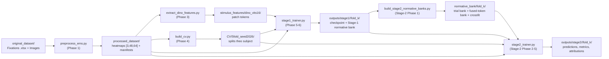
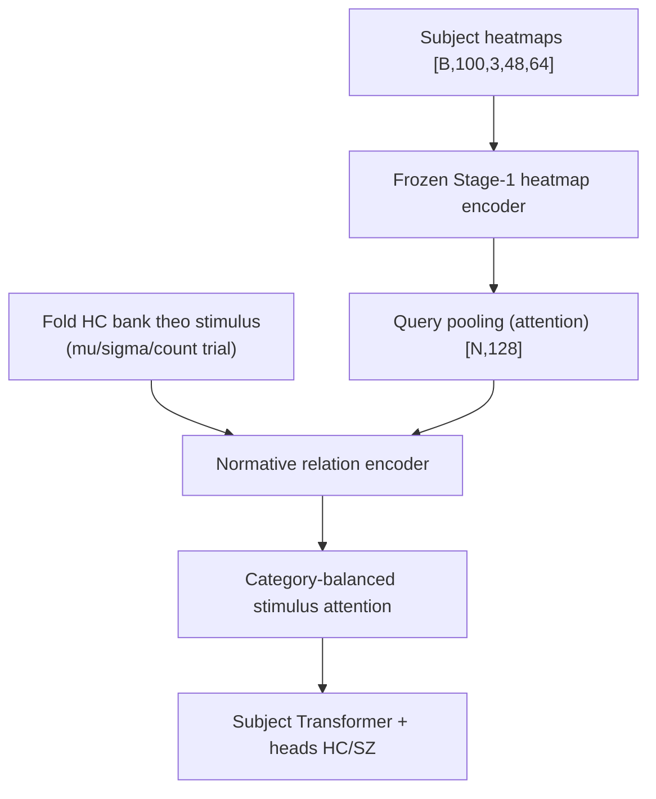

# EMS Project — Pipeline phân tích chuyển động mắt từ preprocessing đến chẩn đoán HC/SZ

> **Ngôn ngữ:** 🇻🇳 Tiếng Việt | 🇬🇧 [English](README.en.md)

Repository này xây dựng pipeline nghiên cứu **eye-movement (fixation) → heatmap → biểu diễn chuẩn (normative) → phân loại chẩn đoán** trên bộ dữ liệu EMS (Healthy Control **HC** vs Schizophrenia **SZ**). Toàn bộ pipeline gồm 3 giai đoạn lớn:

1. **Preprocessing & chuẩn bị dữ liệu** — biến fixation events thô thành heatmap 3 kênh chuẩn hoá, trích đặc trưng ảnh kích thích bằng DINO (frozen), và tạo split CV 5-fold theo subject.
2. **Stage-1** — huấn luyện **HC-only semantic-conditioned normative encoder**: mỗi trial HC được mã hoá thành embedding 128 chiều, tái tạo lại heatmap bị che (masked reconstruction) đồng thời nhất quán giữa các người xem khoẻ mạnh (leave-one-out cosine consistency). Đầu ra là checkpoint mỗi fold + **normative bank** theo stimulus.
3. **Stage-2** — dùng encoder Stage-1 đã đóng băng + normative bank để **phân loại subject HC/SZ**, với đơn vị phân loại là **subject** (không phải trial).

Tài liệu chi tiết từng giai đoạn nằm trong `readme/`:

| Tài liệu | Nội dung |
|---|---|
| [`readme/preprocessed/README.md`](readme/preprocessed/README.md) | Schema processed dataset, định nghĩa 3 kênh heatmap, thống kê dân số & QC, EDA mô tả |
| [`readme/Stage1/README.md`](readme/Stage1/README.md) | Kiến trúc Stage-1, losses, lịch training, chính sách best-checkpoint, normative bank |
| [`readme/Stage2/README.md`](readme/Stage2/README.md) | Kiến trúc Stage-2, bảng ablation, lệnh chạy, bảo vệ leakage, troubleshooting |

> **Lưu ý:** 3 tài liệu trên là *static artifact* — các script sinh tự động đã bị gỡ theo yêu cầu, nên sau khi thay đổi code/config cần cập nhật chúng thủ công. README này là bản tổng hợp; mọi số liệu dưới đây được lấy từ code/config hiện có (không suy diễn).

Hướng dẫn triển khai theo phase (dùng cho phát triển, kèm contract từng giai đoạn) nằm trong `docs/claude-stage1-guide/` và `docs/claude-stage2-guide/`.

---

## 1. Tổng quan dữ liệu

### 1.1 Original Dataset (không bao giờ bị sửa)

```
original_dataset/EMS/
├── All_Data/Fixations/     # 1 workbook .xlsx cho mỗi subject, sheet "Free_viewing"
└── Images/                 # 100 ảnh kích thích 1024×768, chia 4 category:
    ├── Manipulated Images  (32 ảnh)
    ├── Natural Scenes      (31 ảnh)
    ├── Social Scenes       (22 ảnh)
    └── Synthetic Images    (15 ảnh)
```

- Mỗi dòng fixation gồm: `IMAGE`, `FIX_INDEX` (thứ tự fixation), `FIX_DURATION` (ms), `FIX_X`, `FIX_Y` (toạ độ trên canvas 1024×768), `FIX_PUPIL` (chỉ giữ cho QC).
- **Không có timestamp hay gaze samples** — thông tin thời gian duy nhất là thứ tự và duration của fixation.
- **Nhãn chẩn đoán** (theo rule của dataset): subject có numeric ID **< 200 → HC (0)**, **≥ 200 → SZ (1)** (`label_rule: numeric_id_below_split_is_hc`, `hc_sz_split: 200` trong `configs/preprocessing.yaml`).

### 1.2 Processed Dataset — `processed_dataset/`

Là **deterministic cache** cho mọi stage phía sau (DINO, CV, Stage-1, Stage-2). **Không chứa** model, thống kê CV, normative bank hay bất kỳ chuẩn hoá dân số nào — chỉ xử lý từng trial độc lập.

```
processed_dataset/
├── dataset_metadata.json         # bản ghi hoàn thành (viết cuối cùng; reader yêu cầu có file này)
├── preprocessing_config.json     # config đã resolve đầy đủ
├── source_inventory.json         # SHA-256 inventory ảnh/subject + đo đạc anomaly
├── image_manifest.csv            # stimulus_index, stimulus_id, category, path, kích thước, sha256
├── subject_manifest.csv          # subject_id, group, label, source_workbook, n_trials, ...
├── trial_manifest.parquet/.csv   # 1 dòng/trial: trial_uid, subject_id, stimulus_id, các chỉ số QC...
├── qc_summary.json               # tổng QC toàn cục + danh sách trial bị loại
└── subjects/<subject_id>/        # ID giữ nguyên leading zero ("000", "203")
    ├── heatmaps.npy              # float32 [n_trials, 3, 48, 64]
    ├── stimulus_indices.npy      # int64 [n_trials], theo stimulus_index tăng dần
    ├── trial_qc.parquet          # QC từng trial
    └── artifact_meta.json        # config hash, source checksum, array checksums
```

**Quy tắc định danh:** `subject_id` = tên workbook giữ nguyên leading zeros; `stimulus_index` = số nguyên liên tục gán qua `image_manifest.csv` (sắp theo category rồi basename); khoá trial = `(subject_id, stimulus_id)` với `trial_uid` băm SHA-256. Truy xuất mảng phải qua manifest, **không dùng độ lớn ID làm offset**.

### 1.3 Thống kê dân số (đo từ artifact thực tế)

- **160 subjects**: 80 HC / 80 SZ
- **100 stimuli** (32 / 31 / 22 / 15 theo category)
- **225.159 dòng fixation**; **15.912 trial quan sát được** (15.907 đủ điều kiện có heatmap, 5 bị loại vì không còn fixation không gian hợp lệ)
- Số trial/subject: min 63, max 100, mean 99.5; **12 subject thiếu stimulus** (thiếu nhiều nhất: `216` còn 63 trial, `259` còn 68 trial)
- Fixation/trial: min 1, median 14.0, max 39

### 1.4 Định nghĩa chính xác 3 kênh heatmap

Mọi heatmap là `float32 [3, 48, 64]`, thứ tự kênh **bất biến**:

| Kênh | Nội dung | Khoảng giá trị |
|---|---|---|
| 0 | **Fixation density** — tổng các Gaussian unit-mass (σ = 2.0 ô, cắt ở 4σ, kernel cắt biên chuẩn hoá lại về tổng 1) | ≥ 0, mass ≈ số fixation dùng |
| 1 | **Transition density** — mỗi cặp fixation liên tiếp (theo `FIX_INDEX` gốc, cả 2 endpoint hợp lệ) được rasterize với bước ≤ 0.5 ô, chuẩn hoá unit-mass rồi làm mịn Gaussian | ≥ 0, mass ≈ số transition dùng |
| 2 | **Temporal progression τ** — đồng hồ tái tạo từ fixation duration: τᵢ = 2·tᵢᵐⁱᵈ − 1 với tᵢᵐⁱᵈ = (Σ_{k<i} d_k + dᵢ/2)/Σ_k d_k; H_P = Σᵢ τᵢGᵢ/(H_F+ε) | ≈ [−1, 1] |

Chuyển toạ độ fixation `(x, y)` trên canvas 1024×768: `u = x·(W−1)/(1024−1)`, `v = y·(H−1)/(768−1)` với `W=64, H=48`.

**Chính sách lọc event:** fixation ngoài canvas bị loại khỏi bản đồ không gian (policy `drop`) nhưng vẫn đếm trong QC; fixation có duration ≤ 0 bị drop (`min_fix_duration_ms=0.0`, `drop_nonpositive_duration=true`); trial không còn fixation không gian khả dụng có `qc_status="excluded_no_spatial_fixations"` và **không có dòng heatmap**. Các fixation bị loại không bao giờ được "bắc cầu" khi rasterize transition.

---

## 2. Môi trường

- Python **3.12** (`.python-version`), quản lý gói bằng **uv** (`pyproject.toml`, `uv.lock`, `.venv/`).
- Dependencies chính: `torch>=2.3`, `torchvision>=0.18`, `numpy`, `pandas`, `pyarrow`, `openpyxl`, `pillow`, `scikit-learn`, `scipy`, `matplotlib`, `pyyaml`.

```bash
cd /root/EMS-Project
uv sync                        # tạo .venv với đúng phiên bản trong uv.lock
source .venv/bin/activate
```

Các script root tự chèn `src/` vào `sys.path` nên không cần cài package; các module nằm trong `src/{preprocessing, stimulus_extraction, cv, stage1, stage2}`.

---

## 3. Tổng quan các phase của project

Project được xây theo 2 bộ hướng dẫn phase (`docs/claude-stage1-guide/` cho chuẩn bị dữ liệu + Stage-1; `docs/claude-stage2-guide/` cho Stage-2). Mỗi phase có contract, gate và artifact riêng:

| Stage | Phase | Nội dung | Script/Module chính | Artifact |
|---|---|---|---|---|
| Data | 0 | Audit & quyết định kiến trúc (Stage-1) | — | `docs/claude-stage1-guide/` |
| Data | 1 | Preprocessing fixation → heatmap | `preprocess_ems.py` | `processed_dataset/` |
| Data | 2 | EDA mô tả (HC/SZ, 1 giá trị/subject) | `src/preprocessing/eda.py` | `readme/preprocessed/` (figures, EDA summary) |
| Data | 3 | Trích đặc trưng DINO ViT-S/16 (frozen) | `extract_dino_features.py` | `stimulus_features/dino_vits16/` |
| Data | 4 | Split CV 5-fold theo subject (stratified) | `build_cv.py` | `CV/5fold_seed2026/` |
| Stage-1 | 5 | Implement HC-normative encoder + training | `stage1_trainer.py` | `outputs/stage1/<run>/fold_k/` |
| Stage-1 | 6 | Trainer, ablations, tài liệu | `stage1_trainer.py --ablation` | `configs/stage1/ablations/` |
| Stage-1 | 7 | QA & handoff | — | tests, README |
| Stage-2 | 0 | Audit & 5 quyết định A–E | — | `configs/stage2/stage1_checkpoints.yaml` |
| Stage-2 | 1 | Build normative banks 5 fold (trial + fused-token, crossfit 4-way) | `build_stage2_normative_banks.py` | `normative_bank/fold_*/` |
| Stage-2 | 2 | Subject dataset & dataloader | `src/stage2/dataset.py` | — |
| Stage-2 | 3 | Model & losses | `src/stage2/model.py`, `losses.py` | — |
| Stage-2 | 4 | Ablation framework | `src/stage2/ablations.py` | `configs/stage2/ablations/` |
| Stage-2 | 5 | Trainer, validation, logging | `stage2_trainer.py` | `outputs/stage2/<run>/fold_k/` |
| Stage-2 | 6 | README & QA handoff | — | `readme/Stage2/README.md` |

**Các quyết định Phase-0 của Stage-2 (đã được phê duyệt):**

| Quyết định | Lựa chọn | Ý nghĩa |
|---|---|---|
| **A — evaluation regime** | **A1** `pilot_existing_stage1` | Tái sử dụng 5 checkpoint Stage-1 hiện có (SHA-pinned). Mọi kết quả trên outer fold được gán nhãn `outer_fold_exploratory` — **không phải** ước lượng hold-out nghiêm ngặt. `strict_nested_stage1` bị từ chối do không có checkpoint Stage-1 chọn nội tại từng fold. |
| **B — bank contents** | **B2** trial + fused-token bank | `mu/sigma/count_trial [100,128]` + `mu/sigma_token [100,192,128]`. Không build heatmap-token bank. |
| **C — self-inclusion** | **C1** four-way crossfit | Training subject không bao giờ nhận bank do chính các trial của nó đóng góp. |
| **D — encoder policy** | **D1** frozen Stage-1 heatmap encoder | Chỉ ablation `unfreeze_last_block` mới huấn luyện residual block cuối (lr ×0.1 + anchor loss). |
| **E — base model** | **E1** trial-bank primary model | Token-attention là ablation (`token_bank_serial_attention`), không phải base. |

---

## 4. Architecture tổng quát

### 4.1 Pipeline end-to-end



### 4.2 Stage-1 — HC-only semantic-conditioned normative encoder

Stage-1 **chỉ train trên trial HC** của fold hiện tại (SZ bị lọc ngay ở biên dataset). Không có VICReg, contrastive loss (InfoNCE/SupCon), loss phân loại SZ hay bất kỳ classifier chẩn đoán nào.

```text
heatmap [N,3,48,64]
  -> Conv2d(3,128,k=4,s=4) -> GN+GELU -> [N,192,128]   # heatmap encoder (192 tokens trên grid 12×16)
  -> masked-token replacement -> fixed 2-D sincos positions
  -> 2 residual blocks                                   H0
  -> cross-attention 1 (Q=H0, K/V=adapted DINO) + gamma_1 residual      H1
  -> spatial NN bridge (LN -> 128->256 GELU -> dwconv 3x3 -> GN+GELU -> 256->128) + eta residual  M
  -> cross-attention 2 (Q=M, K/V=same adapted DINO) + gamma_2 residual  H2
  -> LayerNorm                                            Z  [N,192,128]
  -> decoder (ConvT(128,64,k4,s4) -> res block -> 1x1 -> 3 ch)   # tái tạo 3 kênh
  -> attention pooling (softmax(w2^T tanh(W1 z_j)))        z  [N,128]
```

- **Adapter DINO:** mỗi ảnh kích thích (resize deterministic 512×384) qua DINO ViT-S/16 frozen cho patch tokens `[768, 384]` trên grid 24×32 → reshape `[384,24,32]` → `DepthwiseConv2d(384,384,k=2,s=2)` → `Conv2d(384,128,k=1)` → `[128,12,16]` → `[192,128]`. Cả 2 nhánh cùng cho grid 12×16 thẳng hàng chính xác (1 DINO patch = 2×2 ô heatmap; adapter gộp 2×2 DINO patch; encoder heatmap gộp 4×4 ô).
- Hai cross-attention **độc lập tham số**, chỉ dùng chung tensor K/V DINO đã adapt. Thứ tự chuẩn `Attention 1 → spatial bridge → Attention 2` là bất biến ở base.
- Cổng residual khởi tạo `gamma_1 = gamma_2 = 0.1/2`, `eta = 0.1` (mặc định học được).
- **Tổng tham số: 617.479** (toàn bộ trainable).

**Losses:**

```text
L_rec   = sum_c w_c * mean_{masked pixels} SmoothL1(recon_c, target_c)   # 3 kênh, trọng số [1,1,1]
mu_{-h,s} = (1/(H-1)) sum_{h' != h} z_{h',s}                              # centroid stop-grad
L_norm  = (1/N) sum_{h,s} [1 - cos(z_{h,s}, sg(mu_{-h,s}))]               # leave-one-out
L_stage1 = L_rec + lambda_norm * L_norm (+ dispersion-floor hinge trên stimulus centroids:
           lambda_spread=5.0, spread_floor=0.1 — chống sụp về mean)
```

**Lịch training (50 epochs):**

| Giai đoạn | Epoch | Nội dung |
|---|---|---|
| Phase A | 0–9 | Warm-up tái tạo, `lambda_norm = 0` |
| Phase B | 10–14 | Ramp tuyến tính `lambda_norm` lên 0.1 |
| Phase C | 15–49 | Objective đầy đủ |

Chỉ epoch **≥ 15** mới đủ điều kiện thành best checkpoint (`best_eligible_after_norm_ramp=true`); metric chọn model là `val_loss` (cùng `lambda_norm` với training; từng thành phần loss được log riêng).

### 4.3 Stage-2 — HC-normative diagnostic subject classification

Stage-2 **không chạy DINO hay semantic fusion** cho subject cần dự đoán: query path chỉ dùng heatmap encoder Stage-1 đã đóng băng (base), còn normative bank là artifact Stage-1 tính sẵn. Vì Stage-1 trial embedding là **post-fusion** còn query Stage-2 đến từ encoder heatmap **pre-fusion**, mọi so sánh đều đi qua các phép chiếu học được — không bao giờ trừ trực tiếp query với bank như thể cùng không gian.



**Luồng tensor (base, trial bank):**

1. Heatmap từng trial qua encoder frozen → heat tokens `[N,192,128]` → query pooling học được → `q0 [N,128]`.
2. **Normative relation encoder** (`src/stage2/relation.py`):
   - `QueryProjection`: `LayerNorm → Linear(128,128)` → `q`.
   - `BankMeanAdapter`: `LayerNorm → Linear(128,128)` trên `mu` của stimulus khớp → `n_mu`.
   - `BankSigmaAdapter`: `concat(LayerNorm(log σ), log count) [129] → Linear(129,256) → GELU → Linear(256,128)` → `uncertainty_context`.
   - `ReliabilityHead`: `[mean(−log σ), log count] → MLP → sigmoid` → `rho ∈ (0,1)`.
   - Vector relation feature **[770]** = ghép `q, n_mu, uncertainty_context, q−n_mu, |q−n_mu|, q⊙n_mu, cos(q,n_mu), rho` (6×128 + 2) → MLP `Linear(770,256) → GELU → Dropout → Linear(256,128)` + shortcut query projection → LayerNorm → `z_trial [N,128]`.
3. Scatter `z_trial` vào panel `[B,100,128]` với missing mask (trial thiếu bị loại khỏi mọi softmax/loss).
4. **Category-balanced stimulus attention** `[B,100]` — trọng số chọn lọc stimulus, cân bằng theo category để category đông ảnh không lấn át.
5. **Subject Transformer** (1 layer, FFN 256) → subject embedding `[B,128]`.
6. Hai head song song: head chính (BCE) và **auxiliary evidence head** — học dự đoán từ bằng chứng cộng tính theo stimulus (additive-evidence), được giám sát bởi `L_aux`.

**Losses Stage-2:**

| Thành phần | Mức | Mục đích | Trọng số base |
|---|---|---|---|
| `L_cls` | subject `[B]` | BCE phân loại chính | 1.0 |
| `L_aux` | subject `[B]` | BCE cho head additive-evidence | 0.3 |
| `L_trialmatch` | trial HC | căn chỉnh query ↔ bank stimulus khớp | 0.1 (chung `lambda_match`) |
| `L_bankrank` | trial HC | margin giữa stimulus khớp vs sai stimulus | 0.1 (chung `lambda_match`) |
| `L_cons` | subject | dự đoán nhất quán giữa các subset stimulus | 0.1 |
| `L_ent` | subject | chống attention sụp sớm về một stimulus | 0.01 |
| `L_anchor` | tham số encoder | neo trọng số Stage-1 (chỉ ablation unfreeze) | 0.0 |

```text
L_total = L_cls + 0.3·L_aux + 0.1·L_match + 0.1·L_cons + 0.01·L_ent + λ_anchor·L_anchor
```

**Lịch training Stage-2:**

1. **Phase 2A** — HC-only bank alignment warm-up (10 epochs, chỉ `L_match`, **không bao giờ** eligible best);
2. **Phase 2B** — HC/SZ diagnostic training (50 epochs, objective đầy đủ);
3. (tuỳ chọn) fine-tune block cuối encoder — chỉ trong ablation `unfreeze_last_block`;
4. **Calibration** từ các prediction không thuộc test (`validation.calibrate: true`).

**Luật chọn best epoch (có thứ tự):** `val_balanced_accuracy` → `val_auroc` → `val_loss` thấp hơn → epoch sớm hơn. Early stopping patience 10. Khi một fold chỉ có 1 class, AUROC/balanced accuracy được lưu là `null` kèm cảnh báo — không bao giờ thay bằng 0.

**Normative bank Stage-2** (build bởi `build_stage2_normative_banks.py`, config `configs/stage2/bank.yaml`):

- Mỗi outer fold: nạp checkpoint Stage-1 duy nhất theo registry (SHA-256 pinned) → chỉ dùng **training-HC contributors** → inference Stage-1 đầy đủ không mask → gộp theo `stimulus_index` → tích luỹ mean & phương sai chéo (float64).
- Các file: `mu_trial [100,128]`, `sigma_trial [100,128]`, `count_trial [100]`, `mu_token/sigma_token [100,192,128]`, `feature_manifest.csv`, `metadata.json`, `audit.json` + thư mục `crossfit/` (4-way: mỗi training subject dùng bank mà tập đóng góp HC của nó loại trừ chính split của subject đó).
- `estimator: mean`, `epsilon: 1e-6` (clamp phương sai), `min_samples: 2` (stimulus có < 2 người đóng góp bị đánh dấu), `batch_size: 64`.
- Build xong **verify** rằng không subject held-out nào đóng góp vào bank của fold mình.

---

## 5. Cách chạy pipeline theo thứ tự

Mọi lệnh chạy từ repo root. Các file `.py` ở root là các CLI mỏng; toàn bộ logic nằm trong `src/`.

### Bước 1 — Preprocessing (Phase 1)

```bash
# Dry-run: inventory + validate, không ghi gì
python preprocess_ems.py --config configs/preprocessing.yaml --dry-run

# Chạy đầy đủ → processed_dataset/
python preprocess_ems.py --config configs/preprocessing.yaml

# Chỉ chạy lại subjects đã đổi / ép ghi đè
python preprocess_ems.py --config configs/preprocessing.yaml --resume
python preprocess_ems.py --config configs/preprocessing.yaml --force

# Smoke test với vài subject (bắt buộc --output-root riêng, không ghi vào dataset chuẩn)
python preprocess_ems.py --config configs/preprocessing.yaml --subjects 000 001 \
  --output-root /tmp/preprocess_smoke
```

### Bước 2 — EDA (Phase 2, tuỳ chọn)

EDA là các hàm trong `src/preprocessing/eda.py` (ví dụ `compute_eda_summary(processed_root, command)`); mọi phép so sánh nhóm đều gộp về **1 giá trị mỗi subject** trước khi tính thống kê. `readme/preprocessed/` (figures + `eda_summary.json`) là artifact tĩnh đã sinh từ trước.

### Bước 3 — Trích đặc trưng DINO (Phase 3)

```bash
python extract_dino_features.py \
  --config configs/dino_vits16.yaml \
  --image-manifest /root/EMS-Project/processed_dataset/image_manifest.csv \
  --output-root /root/EMS-Project/stimulus_features

# Verify artifact hiện có / tiếp tục / ghi đè
python extract_dino_features.py --config configs/dino_vits16.yaml --verify-only
python extract_dino_features.py --config configs/dino_vits16.yaml --resume
python extract_dino_features.py --config configs/dino_vits16.yaml --force

# Smoke test
python extract_dino_features.py --config configs/dino_vits16.yaml \
  --stimulus-limit 3 --output-root /tmp/dino_smoke
```

Output: `stimulus_features/dino_vits16/{patch_tokens.npy, feature_manifest.csv, validation_report.json, extraction_config.json, model_metadata.json}`.

### Bước 4 — Split CV 5-fold (Phase 4)

```bash
python build_cv.py \
  --config configs/cv_5fold.yaml \
  --subject-manifest /root/EMS-Project/processed_dataset/subject_manifest.csv \
  --trial-manifest /root/EMS-Project/processed_dataset/trial_manifest.parquet \
  --output-root /root/EMS-Project/CV

python build_cv.py --config configs/cv_5fold.yaml ... --verify-only
```

Output: `CV/5fold_seed2026/` với `fold_<k>/{train_subjects.csv, val_subjects.csv, train_trials.parquet, val_trials.parquet}` + `cv_config.json`, `cv_metadata.json`, `validation_report.json`. **Đơn vị độc lập là subject** — validation subject không bao giờ xuất hiện trong training của fold mình; Stage-1 chỉ dùng hàng HC của chính các partition này.

### Bước 5 — Train Stage-1 (Phase 5–6)

```bash
# Từng fold (0..4) hoặc tất cả tuần tự với output cô lập
python stage1_trainer.py --config configs/stage1/base.yaml --fold 0
python stage1_trainer.py --config configs/stage1/base.yaml --fold all

# Smoke test
python stage1_trainer.py --config configs/stage1/base.yaml --fold 0 \
  --max-epochs 2 --max-train-batches 3 --max-val-batches 3 --run-name smoke

# Kiểm tra input + tensor contracts không tối ưu
python stage1_trainer.py --config configs/stage1/base.yaml --fold 0 --dry-run

# Resume chính xác (phục hồi optimizer/scheduler/RNG)
python stage1_trainer.py --resume outputs/stage1/<run>/fold_0/checkpoints/last_stage1_fold0.pt

# Chỉ khởi tạo weights, optimizer/scheduler/run mới
python stage1_trainer.py --config configs/stage1/base.yaml --fold 0 \
  --load-stage1-weights outputs/stage1/<run>/fold_0/checkpoints/best_stage1_fold0.pt

# Build lại normative bank của fold từ checkpoint best
python stage1_trainer.py --build-norm-bank \
  --checkpoint outputs/stage1/<run>/fold_0/checkpoints/best_stage1_fold0.pt

# Ablation (1 yếu tố thay đổi so với base.yaml)
python stage1_trainer.py --config configs/stage1/base.yaml --ablation no_semantic --fold 0
```

Các ablation Stage-1: `no_semantic`, `aligned_add_fusion`, `concat_fusion`, `single_cross_attention`, `no_spatial_bridge`, `token_mlp_bridge`, `no_fusion_residual`, `fixed_fusion_gates`, `mean_pooling`, `no_norm_loss`, `full_reconstruction`, `fixation_only`, `no_transition_channel`, `no_temporal_channel`, `avgpool_semantic_adapter`.

Output: `outputs/stage1/<run_id>/` (run metadata + `fold_<k>/` với `history.csv`, `checkpoints/`, `validation/`, `normative_bank/`).

### Bước 6 — Build normative banks cho Stage-2 (Stage-2 Phase 1)

```bash
# Build cả 5 fold theo registry checkpoint Stage-1
python build_stage2_normative_banks.py \
  --checkpoint-registry configs/stage2/stage1_checkpoints.yaml \
  --config configs/stage2/bank.yaml --fold all

# Verify read-only
python build_stage2_normative_banks.py \
  --checkpoint-registry configs/stage2/stage1_checkpoints.yaml \
  --config configs/stage2/bank.yaml --fold all --verify-only

# Smoke: 1 fold, output riêng, không kèm token banks
python build_stage2_normative_banks.py \
  --checkpoint-registry configs/stage2/stage1_checkpoints.yaml \
  --config configs/stage2/bank.yaml --fold 0 --output-root <smoke root> \
  --no-include-fused-token-bank --no-include-heatmap-token-bank
```

Output: `normative_bank/fold_<k>/` như mô tả ở mục 4.3.

### Bước 7 — Train Stage-2 (Stage-2 Phase 2–5)

```bash
# Verify-only / dry-run
python stage2_trainer.py --config configs/stage2/base.yaml --fold 0 --verify-only
python stage2_trainer.py --config configs/stage2/base.yaml --fold 0 --dry-run \
  --max-train-subjects 4 --max-val-subjects 4 --max-train-batches 1 --max-val-batches 1

# Smoke run được đánh dấu tường minh (không phải kết quả thí nghiệm)
python stage2_trainer.py --config configs/stage2/base.yaml --fold 0 --smoke \
  --max-train-subjects 4 --max-val-subjects 4 --max-train-batches 1 --max-val-batches 1 \
  --override optimization.alignment_epochs=0 --override optimization.classification_epochs=2

# Train chính thức: bỏ các flag --max-*
python stage2_trainer.py --config configs/stage2/base.yaml --fold 0
python stage2_trainer.py --config configs/stage2/base.yaml --fold all

# Ablation có tên (registry dry-run cho mọi ablation chạy được)
python stage2_trainer.py --config configs/stage2/base.yaml --fold all --ablation no_bank
python -m stage2.ablations --fold 0 --dry-run-all

# Resume chính xác / khởi tạo weights-only
python stage2_trainer.py --resume outputs/stage2/<run_id>/fold_0/checkpoints/last_stage2_fold0.pt
python stage2_trainer.py --load-stage2-weights outputs/stage2/<run_id>/fold_0/checkpoints/best_stage2_fold0.pt
```

Các flag hữu ích khác: `--seed`, `--evaluation-regime {pilot_existing_stage1,strict_nested_stage1}` (chỉ regime đầu khả dụng — quyết định A1), `--stage1-checkpoint` (phải byte-identical với registry, SHA-256), `--bank-root`, `--output-root`, `--device`, `--num-workers`, `--deterministic`, `--override KEY=VALUE` (dotted-key, áp sau ablation overlay, lặp lại được).

> Các flag giới hạn (`--max-*`) **chỉ hợp lệ khi đi kèm** `--dry-run` hoặc `--smoke`; resume và load-weights loại trừ lẫn nhau. Exit code: 0 ok, 1 lỗi usage/config/verify, 2 lỗi training fold.

### Bước 8 — Tests

```bash
python -m pytest tests/preprocessing -q
python -m pytest tests/stage1 -q
python -m pytest tests/stage2 -q
```

---

## 6. Các step quan trọng trong training/evaluation

### 6.1 Stage-1

- **Masking:** 35% token trên grid 12×16 bị che cả train lẫn validation; mask token được upsample bằng cách lặp mỗi token trên patch 4×4 của nó; loss chỉ tính trên pixel bị che.
- **Chọn model:** chỉ epoch ≥ 15 eligible (sau ramp chuẩn hoá); metric `val_loss`; patience 10.
- **Normative bank sau training:** từ checkpoint best, inference **không mask** trên mọi trial HC outer-training → thống kê theo stimulus; validation IDs được assert vắng mặt trong bank.
- **history.csv** được ghi bền vững sau mỗi epoch (~50 cột: phases, eligibility, best, lr, lambda_norm, các loss thành phần, dispersion, gate values, mask ratios, gradient stats, seed...).

### 6.2 Stage-2

- **Đơn vị độc lập là subject** cho cả fold, batching, losses, metrics, bootstrap và CI. Một subject = một panel tối đa 100 trial (trials thiếu được mask).
- **Phase 2A** (10 epoch alignment, chỉ `L_match`) không bao giờ eligible best; best chỉ xét trong Phase 2B.
- **Luật chọn best:** `val_balanced_accuracy` → `val_auroc` → `val_loss` → epoch sớm hơn.
- **Calibration:** sau training, calibrate từ prediction không thuộc test (`validation/calibration.json`).
- **Attribution:** `stimulus_attention` (trọng số chọn stimulus, category-balanced), `stimulus_evidence` (bằng chứng HC/SZ có dấu), `stimulus_contribution = attention × evidence`, `normative_deviation`, `semantic_compatibility`. Đây là tín hiệu attribution, **không phải** chứng minh nhân quả; kiểm soát khuyến nghị: fold/seed stability, leave-one-stimulus-out so với xoá ngẫu nhiên theo category, bootstrap CI theo subject.
- **history.csv** commit nguyên tử sau mỗi epoch (checkpoint → history → `epoch_commit.json`, tất cả atomic + fsync) với ~70 cột (xem `readme/Stage2/README.md` §10).

### 6.3 Kiểm soát leakage & reproducibility (áp cả 2 stage)

- Folds theo subject; validation subject không bao giờ nằm trong training của fold mình.
- Stage-1 train **chỉ trên HC trials** của fold; mọi thống kê kênh (nếu có) chỉ fit trên training HC.
- Checkpoint/bank Stage-1 được SHA-256 pin trong `configs/stage2/stage1_checkpoints.yaml`; mọi mismatch checksum **abort run** thay vì fallback.
- Crossfit bank: training HC không nhận bank do chính nó xây (`audit/leakage_checks.json`).
- Config hash (bất biến với thứ tự key) + source checksums được ghi cho mỗi run.
- Validation xác định (thứ tự cố định, subset mask cố định, inference mode); exact resume phục hồi optimizer/scheduler/scaler/RNG/sampler/trạng thái best-rule và bị từ chối khi fold/config/checksum khác.
- Kết quả regime `pilot_existing_stage1` trên outer fold được gán nhãn `outer_fold_exploratory` — không được báo cáo như hold-out nghiêm ngặt.

---

## 7. Giải thích cấu hình chính

### 7.1 `configs/preprocessing.yaml`

| Tham số | Giá trị | Ý nghĩa / ảnh hưởng |
|---|---|---|
| `raw_root`, `fixation_root`, `image_root`, `output_root` | paths | Nguồn dữ liệu thô và nơi ghi `processed_dataset/` |
| `subject_glob`, `subject_filename_regex` | `*.xlsx`, `^[0-9]+[.]xlsx$` | Chỉ nhận workbook có tên thuần số (ID subject) |
| `sheet_name` | `Free_viewing` | Sheet chứa dữ liệu fixation trong mỗi workbook |
| `columns.*` | `IMAGE, FIX_INDEX, FIX_DURATION, FIX_X, FIX_Y, FIX_PUPIL` | Ánh xạ tên cột trong sheet |
| `label_rule`, `hc_sz_split` | `numeric_id_below_split_is_hc`, `200` | ID < 200 → HC (0), ≥ 200 → SZ (1) |
| `source_width/height` | 1024/768 | Canvas gốc để chuẩn hoá toạ độ |
| `heatmap_height/width` | 48/64 | Lưới heatmap đầu ra |
| `gaussian_sigma_cells` | 2.0 | σ của Gaussian mỗi fixation (ô lưới) — độ lan toạ độ của một fixation |
| `gaussian_truncate_sigma` | 4.0 | Cắt Gaussian ở 4σ; kernel biên được chuẩn hoá lại về unit mass |
| `transition_sample_step_cells` | 0.5 | Bước sub-cell khi rasterize đoạn transition — càng nhỏ càng mịn, càng chậm |
| `temporal_epsilon` | 1e-8 | Tránh chia 0 khi chuẩn hoá kênh thời gian |
| `off_canvas_policy` | `drop` | Fixation ngoài canvas bị loại khỏi bản đồ không gian (vẫn đếm QC) |
| `zero_spatial_policy` | `exclude_no_spatial` | Trial không còn fixation không gian → `excluded_no_spatial_fixations`, không có heatmap |
| `min_fix_duration_ms`, `drop_nonpositive_duration` | 0.0, true | Drop fixation có duration ≤ 0 |
| `dtype`, `seed` | float32, 2026 | Kiểu lưu trữ và seed toàn pipeline |
| `write_trial_manifest_csv` | true | Xuất thêm `trial_manifest.csv` dễ đọc |

### 7.2 `configs/dino_vits16.yaml`

| Tham số | Giá trị | Ý nghĩa / ảnh hưởng |
|---|---|---|
| `model_name`, `hub_source` | `dino_vits16`, `facebookresearch/dino:main` | DINO ViT-S/16 pretrained (ImageNet), `frozen: true` — không có dữ liệu EMS nào tham gia train |
| `input_height/width`, `resize_mode`, `interpolation` | 384/512, `exact`, bicubic + antialias | Resize deterministic 1024×768 → 512×384 (đúng tỉ lệ 4:3); không crop, không augmentation |
| `output_layer` | `final_normalized_patch_tokens` | Lấy patch tokens đã chuẩn hoá (không lấy CLS) |
| `expected_patch_size/grid/token_dim` | 16, [24,32], 384 | Contract được assert khi extraction — sai là fail ngay |
| `batch_size`, `device` | 1, cpu | Inference tuần tự trên CPU (quyết định Phase-0) |

### 7.3 `configs/cv_5fold.yaml`

| Tham số | Giá trị | Ý nghĩa / ảnh hưởng |
|---|---|---|
| `n_splits` | 5 | 5 fold, mỗi fold ≈ 32 validation subjects |
| `shuffle`, `random_state` | true, 2026 | Shuffle tất định trước khi split |
| `stratify_column` | `label` | Cân bằng tỉ lệ HC/SZ giữa các fold |
| `group_column` | `subject_id` | Toàn bộ trial của một subject nằm cùng một partition (không rò rỉ trial cùng subject) |

### 7.4 `configs/stage1/base.yaml`

| Tham số | Giá trị | Ý nghĩa / ảnh hưởng |
|---|---|---|
| `model.d_model` | 128 | Chiều embedding chung (và chiều token) |
| `model.heatmap_patch_size` | 4 | Mỗi token encoder gộp 4×4 ô heatmap → grid 12×16 |
| `model.semantic_adapter` | `learned_depthwise_2x2` | Cách gộp 2×2 patch DINO (depthwise conv học được) |
| `model.fusion` | `serial_attention_spatial_attention` | Thứ tự chuẩn 2 cross-attention + spatial bridge |
| `model.semantic_gamma_total_init` | 0.1 | Tổng khởi tạo 2 cổng γ (mỗi cái 0.05) — khởi đầu gần như bỏ qua nhánh semantic rồi học tăng dần |
| `model.spatial_bridge_*` | dwconv 3×3, expansion 2.0, η_init 0.1 | Cầu không gian giữa 2 attention; η nhỏ = khởi đầu bảo toàn tín hiệu |
| `model.pooling` | `attention` | Pooling attention học được → embedding trial 128-d |
| `masking.train_mask_ratio` | 0.35 | Tỉ lệ token bị che — tăng = task khó hơn, giảm = dễ overfit |
| `loss.lambda_norm` | 0.1 | Trọng số consistency loss ở giai đoạn cuối (sau ramp) |
| `loss.norm_start_epoch` / `norm_ramp_epochs` | 10 / 5 | Lịch bật dần loss chuẩn hoá |
| `loss.spread_floor` / `lambda_spread` | 0.1 / 5.0 | Hinge chống sụp-to-mean: phạt khi khoảng cách giữa các stimulus centroid < floor |
| `sampler.stimuli_per_batch` / `hc_per_stimulus` | 8 / 8 | Mỗi batch: 8 stimulus × 8 viewer HC = 64 trials; giảm khi OOM |
| `sampler.min_hc_per_stimulus` | 8 | Stimulus có < 8 HC khả dụng bị bỏ qua trong batch (được log) |
| `optimization.epochs` | 50 | Tổng epoch (10 warmup + 5 ramp + 35 joint) |
| `optimization.learning_rate` | 3e-4 | AdamW base LR (tất cả tham số trainable) |
| `optimization.gradient_clip_norm` | 5.0 | Clip gradient — chống non-finite loss |
| `optimization.amp` | true | Automatic Mixed Precision |
| `validation.selection_metric` | `val_loss` | Metric chọn best checkpoint |
| `validation.best_eligible_after_norm_ramp` | true | Warmup/ramp không được so với epoch full-objective |
| `validation.early_stopping_patience` | 10 | Dừng sớm nếu val không cải thiện 10 epoch |
| `runtime.deterministic_validation` | true | Thứ tự/mask validation cố định |
| `paths.*` | — | Trỏ đến `processed_dataset`, DINO features, `CV/5fold_seed2026/fold_0` (trainer tự thay fold khác), output |

### 7.5 `configs/stage2/base.yaml`

| Tham số | Giá trị | Ý nghĩa / ảnh hưởng |
|---|---|---|
| `evaluation_regime` | `pilot_existing_stage1` | Outer-fold chỉ là exploratory (quyết định A1); không đổi sang `strict_nested_stage1` khi có ablation |
| `bank.root`, `bank.train_mode` | `normative_bank/`, `crossfit` | Đường dẫn bank; training dùng bank crossfit (loại chính subject) |
| `bank.checkpoint_registry` | `stage1_checkpoints.yaml` | Registry SHA-pinned: 1 checkpoint Stage-1 duy nhất cho mỗi fold |
| `sampler.subject_batch_size` | 4 | Số subject mỗi batch (mỗi subject tối đa 100 trials) — giảm khi OOM |
| `sampler.balance_groups` | true | Cân bằng HC/SZ trong batch |
| `model.encoder_source` / `freeze_encoder` | `stage1_heatmap_encoder` / true | Transfer encoder heatmap Stage-1 và đóng băng (quyết định D1) |
| `model.query_pooling` | `attention` | Pooling attention học được trên 192 heat tokens |
| `model.relation_hidden` | 256 | Chiều ẩn MLP relation (770 → 256 → 128) |
| `model.bank_mode` | `trial` | Base dùng trial bank; `token_bank_serial_attention` đổi sang fused-token bank |
| `model.category_balanced_attention` | true | Trọng số stimulus cân bằng theo category |
| `model.subject_transformer_layers` / `ffn` | 1 / 256 | 1 lớp Transformer ngữ cảnh hoá giữa các stimulus |
| `model.dropout` | 0.25 | Dropout chung |
| `model.auxiliary_evidence_head` | true | Bật head phụ additive-evidence (được giám sát bởi `L_aux`) |
| `loss.lambda_aux` | 0.3 | Trọng số giám sát head phụ |
| `loss.lambda_match` | 0.1 | Trọng số nhóm loss căn chỉnh (trialmatch + bankrank) |
| `loss.lambda_cons` | 0.1 | Nhất quán giữa các subset stimulus |
| `loss.lambda_entropy` / `entropy_anneal_epochs` | 0.01 / 10 | Chống attention sụp sớm, anneal trong 10 epoch đầu |
| `loss.lambda_anchor` | 0.0 | Chỉ bật trong ablation `unfreeze_last_block` |
| `loss.*_margin` | 0.2 | Margin cho trialmatch / bankrank / tokenmatch |
| `subsets.enabled` / `min/max_fraction` | true / 0.5–0.8 | Subset stimulus ngẫu nhiên (giữ category) cho consistency loss |
| `optimization.alignment_epochs` | 10 | Phase 2A (chỉ `L_match`, không eligible best) |
| `optimization.classification_epochs` | 50 | Phase 2B (objective đầy đủ) |
| `optimization.learning_rate` | 1e-4 | LR chính (các head mới Stage-2) |
| `optimization.encoder_learning_rate` | 1e-5 | LR riêng cho encoder (dùng khi ablation unfreeze; ×0.1) |
| `optimization.gradient_clip_norm` | 1.0 | Clip gradient (chặt hơn Stage-1) |
| `validation.selection_metric` / `secondary_metric` | `val_balanced_accuracy` / `val_auroc` | Luật chọn best có thứ tự |
| `validation.calibrate` | true | Calibrate sau training từ prediction không thuộc test |

### 7.6 `configs/stage2/bank.yaml` + `configs/stage2/stage1_checkpoints.yaml`

- `bank.yaml`: `estimator: mean` (mean/variance chéo float64), `epsilon: 1e-6` (clamp phương sai chéo), `min_samples: 2` (stimulus cần ≥ 2 HC contributors), `batch_size: 64` (inference bank), `include_fused_token_bank: true` / `include_heatmap_token_bank: false` (quyết định B2), `crossfit_splits: 4` + `crossfit_enabled: true` (quyết định C1).
- `stage1_checkpoints.yaml`: ánh xạ mỗi fold 0–4 đến đúng 1 checkpoint Stage-1 best kèm SHA-256. Loader **verify SHA-256 trước mọi inference**; muốn đổi checkpoint phải cập nhật registry một cách chủ ý — CLI `--stage1-checkpoint` chỉ chấp nhận file byte-identical với registry.

### 7.7 Các file ablation

- `configs/stage1/ablations/*.yaml` (15 file): mỗi file đổi **một** yếu tố so với base (xem danh sách ở Bước 5).
- `configs/stage2/ablations/*.yaml` (16 file + base): mỗi ablation khai báo scientific question, reference, changed keys, required bank artifact và loại (variant / negative control / token child). Bảng đầy đủ — gồm 4 negative control (`no_bank`, `wrong_stimulus_bank`, `global_bank`, `random_encoder`) — xem `readme/Stage2/README.md` §11.

---

## 8. Output layout

```
outputs/stage1/<run_id>/
├── run_metadata.json, config_resolved.yaml, environment.json, source_checksums.json
└── fold_<k>/
    ├── history.csv
    ├── checkpoints/{best,last}_stage1_fold<k>.pt
    ├── validation/best_val_embeddings.npz, metrics.json
    └── normative_bank/{mu_trial,sigma_trial,count_trial}.npy, feature_manifest.csv, metadata.json

outputs/stage2/<run_id>/
├── config_resolved.yaml, environment.json, run_metadata.json, source_checksums.json
└── fold_<k>/
    ├── history.csv, epoch_commit.json, train.log
    ├── checkpoints/{best,last}_stage2_fold<k>.pt
    ├── validation/{metrics.json, subject_predictions.parquet, stimulus_attributions.npz, calibration.json}
    └── audit/{bank_match_metrics.json, tensor_shapes.json, leakage_checks.json}

normative_bank/fold_<k>/          # Stage-2 bank (build riêng từ checkpoint Stage-1)
├── mu_trial/sigma_trial/count_trial.npy   # [100,128] / [100,128] / [100]
├── mu_token/sigma_token.npy               # [100,192,128]
├── feature_manifest.csv, metadata.json, audit.json
└── crossfit/                             # 4-way crossfit banks
```

- Một run **đã hoàn thành không bao giờ bị ghi đè**; thư mục partial do init lỗi được dọn và thử lại.
- Stage-1 `--run-name smoke` và Stage-2 `--smoke`/`--dry-run` đều được đánh dấu tường minh trong run ID/metadata để không nhầm với kết quả thí nghiệm.

---

## 9. Troubleshooting nhanh

- **OOM:** giảm `sampler.stimuli_per_batch`/`hc_per_stimulus` (Stage-1) hoặc `sampler.subject_batch_size` (Stage-2); chuyển `--device cuda`.
- **Mismatch manifest/ID:** chạy `python build_cv.py --verify-only` và `python extract_dino_features.py --verify-only`; Stage-1 từ chối khởi động nếu manifest không khớp.
- **Checksum mismatch:** regenerate artifact bằng đúng lệnh phase tương ứng, hoặc dùng `--verify-only` để tìm nơi lệch.
- **Resume bị từ chối:** do khác fold / run ID / config hash / kiến trúc / source checksum — đúng thiết kế; dùng `--load-stage1-weights` / `--load-stage2-weights` nếu muốn khởi tạo weights với config mới.
- **Missing Stage-1 checkpoint (Stage-2):** registry `configs/stage2/stage1_checkpoints.yaml` phải có đúng 1 checkpoint mỗi fold, không có fallback tự động.
- **Token ablation thiếu bank:** token ablations fail ngay khi khởi tạo nếu chưa build fused-token bank (bank.yaml `include_fused_token_bank: true`).
- **Non-finite loss:** Stage-1 giữ epoch hợp lệ và giữ checkpoint trước; Stage-2 dừng cứng và ghi `run_failure.json` — không bao giờ skip batch âm thầm.
- **Metric một class:** AUROC/balanced accuracy được lưu `null` kèm warning, không thay bằng 0.

## 10. Tài liệu chi tiết hơn

- [`readme/preprocessed/README.md`](readme/preprocessed/README.md) — schema, định nghĩa kênh, công thức, thống kê dân số, EDA HC/SZ (mô tả, không phải chẩn đoán).
- [`readme/Stage1/README.md`](readme/Stage1/README.md) — kiến trúc & tensor shapes đo thực tế, losses, lịch training, leakage controls, output layout.
- [`readme/Stage2/README.md`](readme/Stage2/README.md) — bảng ablation đầy đủ, CLI help, history.csv columns, reproducibility safeguards.
- `docs/claude-stage1-guide/`, `docs/claude-stage2-guide/` — hướng dẫn triển khai từng phase kèm contract và gate.
