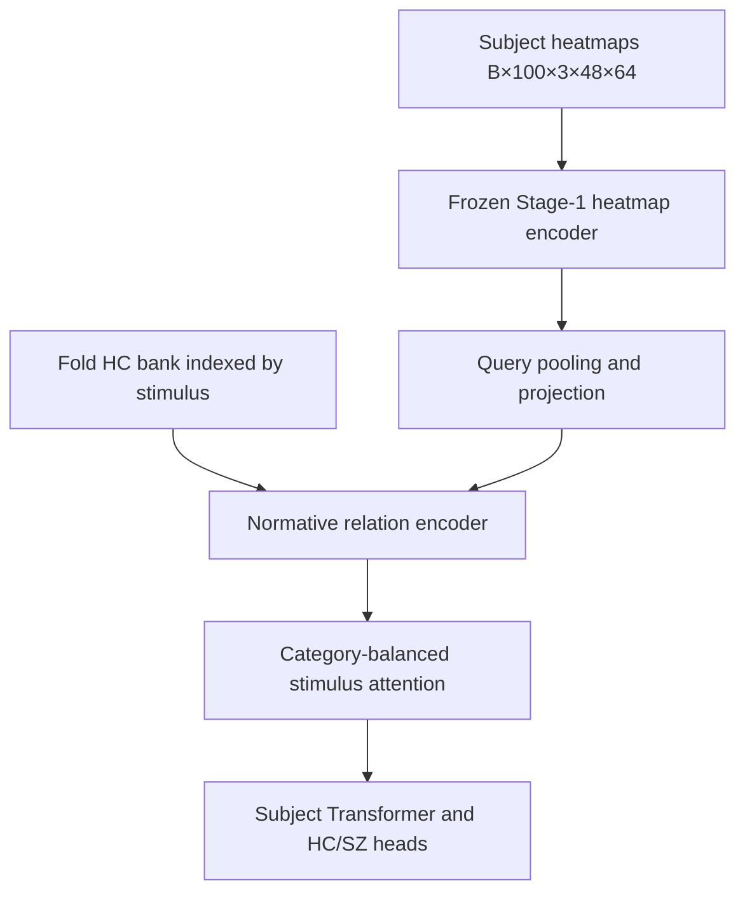

# Phase 6 — generate the Stage-2 README, run final QA and hand off

## Goal

Create and verify:

```text
/root/EMS-Project/readme/Stage2/README.md
```

The README must describe the implemented methodology, exact tensor contracts, losses, normative-bank provenance, training/validation behavior, ablations, interpretation outputs and runnable commands. Then run full repository-level Stage-2 QA and prepare a reproducible handoff.

Do not change the architecture or experimental protocol in this phase. If documentation exposes a defect in an earlier phase, report it and ask whether to return to that phase.

## 1. Preconditions

Require explicit Phase-5 approval. Confirm:

1. Phases 0–5 have completion reports and user approval;
2. all required source/config/test files exist;
3. the selected evaluation regime is recorded;
4. all five fold banks pass verification or missing artifacts are clearly declared;
5. the root trainer passes verify-only and smoke tests;
6. no unresolved training/history/checkpoint defect remains.

## 2. Files to create or change

```text
generate_stage2_readme.py
readme/Stage2/README.md
tests/stage2/test_stage2_readme.py
```

If repository conventions prefer a template, use:

```text
readme/Stage2/README.template.md
```

The generated README is the required artifact. The generator must support:

```bash
python generate_stage2_readme.py
python generate_stage2_readme.py --check
```

`--check` must exit non-zero when the committed/generated README differs from current code, configuration or registry facts.

## 3. Documentation source of truth

Generate volatile facts from the implementation rather than duplicating them manually:

- CLI help from the root parser;
- base hyperparameters from `configs/stage2/base.yaml`;
- ablation names/questions from the registry;
- history columns from `src/stage2/history.py`;
- tensor constants from typed contracts;
- bank schema/version from the bank module;
- output layout from the trainer/path module.

Hand-written explanatory prose may live in the template. Keep generation deterministic: same source tree must produce byte-identical README output.

Do not read real validation scores into the methodology README. Experimental results belong in run outputs or a separate results document.

## 4. Required README structure

Use this section order.

### 4.1 Title and scope

State that Stage 2 performs HC/SZ subject classification using:

- a transferred Stage-1 heatmap encoder;
- a fold-specific HC normative bank indexed by stimulus;
- stimulus-level normative relation features;
- category-balanced attention and subject aggregation;
- optional token-level normative semantic attention.

Explicitly state that Stage 2 does not run DINO or Stage-1 semantic fusion for a query subject.

### 4.2 Dataset and split unit

Document:

```text
160 subjects: 80 HC and 80 SZ
100 stimuli
15,912 available subject-stimulus trials
148 complete and 12 incomplete subjects
heatmap shape [3,48,64]
five subject-level folds
HC=0, SZ=1
```

Label these as expected EMS dataset facts and point to the repository's dataset documentation. The implementation must validate actual manifests instead of hard-coding counts as a substitute for validation.

Emphasize that the subject—not the trial—is the independent classification/evaluation unit.

### 4.3 Stage-1 reuse boundary

Include a table:

| Reused | Not used on Stage-2 query path |
|---|---|
| Heatmap encoder architecture | DINO features |
| Fold checkpoint `heatmap_encoder.*` weights | Stage-1 semantic adapter/fusion |
| Precomputed HC normative bank | Stage-1 decoder/pooling head |
| Checkpoint/config provenance | Cached query embeddings |

Explain the base frozen-encoder policy and the named final-block fine-tuning ablation.

### 4.4 HC normative-bank construction

Document for each outer fold:

1. load the approved fold-specific Stage-1 best checkpoint;
2. select training HC contributors only;
3. run full, unmasked Stage-1 inference;
4. group outputs by `stimulus_index`;
5. accumulate means/diagonal population variances in float64;
6. save arrays, counts, contributor IDs, forbidden validation IDs and checksums;
7. build optional four-way crossfit training banks;
8. verify that no held-out subject contributed.

Show the canonical trial-bank shapes:

```text
mu_trial      [100,128]
sigma_trial   [100,128]
count_trial   [100]
```

Show optional token-bank shapes:

```text
mu_token/sigma_token             [100,192,128]
mu_heat_token/sigma_heat_token   [100,192,128]
```

Clarify that the current Stage-1 trial embedding is post-fusion whereas the Stage-2 query comes from the heatmap encoder. Therefore the base model uses learned query/bank projections and alignment loss; direct raw subtraction is not presented as same-space evidence.

### 4.5 Architecture and tensor walkthrough

Include a compact Mermaid graph and a tensor table. Keep the graph top-down and under five nodes per row.

Required logical flow:



Required base tensor table:

| Tensor | Shape | Meaning |
|---|---:|---|
| `heatmaps` | `[B,100,3,48,64]` | subject panel |
| flattened heatmaps | `[N,3,48,64]`, `N<=B*100` | available trials only |
| heat tokens | `[N,192,128]` | 12×16 row-major patches |
| query vector | `[N,128]` | learned Stage-2 pooling |
| matched bank mean/std | `[N,128]` each | same stimulus |
| relation input | `[N,770]` | query/bank/deviation/cosine features |
| trial embedding | `[B,100,128]` | scatter with missing mask |
| stimulus attention | `[B,100]` | category-balanced importance |
| subject embedding | `[B,128]` | contextual subject representation |
| main/aux logits | `[B]` each | subject-level predictions |

For the optional token model, include `[B,100,192,128]` token tensors and `[B,100,12,16]` semantic maps.

### 4.6 What “important stimulus” and “semantic information” mean

Define distinct outputs:

- `stimulus_attention`: normalized category-balanced selection weight;
- `stimulus_evidence`: signed local HC/SZ evidence;
- `stimulus_contribution = attention * evidence`;
- `normative_deviation`: learned/standardized departure from matched HC norm;
- `semantic_compatibility`: learned query–norm cosine compatibility;
- optional `semantic_patch_map`: token-level matched normative interaction.

State that attention is an attribution signal, not proof of causal importance. Recommend fold/seed stability, leave-one-stimulus-out tests and subject-level bootstrap confidence intervals.

### 4.7 Losses

Document every component with formula, tensor level and purpose:

```text
L_cls         main subject BCE
L_aux         additive-evidence subject BCE
L_trialmatch  matched query/bank alignment
L_bankrank    matched versus wrong-stimulus margin
L_tokenmatch  optional local token alignment
L_cons        subset prediction consistency
L_ent         early attention-collapse regularizer
L_anchor      optional Stage-1 weight anchoring
```

Show the starting total objective:

\[
L_{total}=L_{cls}+0.3L_{aux}+0.1L_{match}
+0.1L_{cons}+0.01L_{ent}+\lambda_{anchor}L_{anchor}.
\]

Explain that loss weights are starting values and must be tuned only within the permitted training/inner-validation data.

### 4.8 Training phases

Document:

1. Phase 2A HC-only bank alignment warm-up;
2. Phase 2B HC/SZ diagnostic training;
3. optional final-block fine-tuning ablation;
4. calibration from permitted non-test predictions.

Explain the validation scope for both `pilot_existing_stage1` and `strict_nested_stage1` and the corresponding claim limitation.

### 4.9 Training commands

Include copy-paste commands for:

- bank verification/build for one fold and all folds;
- base verify-only;
- base dry-run;
- one-fold training;
- five-fold training;
- one named ablation;
- exact resume;
- weight-only initialization;
- evaluation/export from the best checkpoint;
- README regeneration/check;
- Stage-2 tests.

Use real parser options from the implementation. Do not document commands that have not been executed at least in `--help`, `--verify-only` or smoke mode.

### 4.10 Output layout and per-epoch history

Show the output tree from the contract. Explain that `history.csv` is atomically committed immediately after each epoch and contains epoch/phase, learning rates, weight decay, component losses, train/validation metrics, best flag, gradient norms, clipping fraction, counts, timing and memory.

Explain best versus last checkpoints and exact resume checks.

### 4.11 Ablation table

Generate the full registry table with:

```text
name
scientific question
reference configuration
changed keys
required bank artifact
example command
```

Distinguish base-comparison ablations from token-model child ablations and negative controls.

### 4.12 Reproducibility and leakage safeguards

Include:

- subject-level folds/batches/metrics;
- contributor/forbidden-ID bank audit;
- crossfit bank assignment;
- fixed Stage-1/bank checksums;
- deterministic validation;
- config and source hashes;
- seed capture and exact resume;
- strict versus pilot evaluation language.

### 4.13 Troubleshooting

Cover at least:

- missing/ambiguous Stage-1 checkpoint;
- bank/checkpoint hash mismatch;
- absent token bank for token ablation;
- wrong stimulus manifest/order;
- one-class metric warning;
- non-finite loss/gradient;
- history/checkpoint mismatch on resume;
- out-of-memory token maps;
- incomplete subject panels;
- nonzero exit from README `--check`.

## 5. README tests

Add tests that verify:

1. generator output is deterministic;
2. `--check` succeeds immediately after generation;
3. every registered ablation appears exactly once;
4. every documented command uses a real parser option;
5. required tensor shapes and loss names appear;
6. evaluation-regime caveat appears;
7. the README says subject-level, not trial-level, classification;
8. README output path has exact capitalization `readme/Stage2/README.md`;
9. generated content contains no absolute developer-specific path other than the documented repository root;
10. no validation score or fabricated result is embedded.

## 6. Final QA sequence

Run from `/root/EMS-Project` and record exact exit status/output summary.

### 6.1 Worktree and source audit

```bash
git status --short
git diff --check
python -m compileall src/stage2 stage2_trainer.py build_stage2_normative_banks.py generate_stage2_readme.py
```

Inspect the Stage-2 diff for unrelated edits. Do not alter, reset or delete user changes.

### 6.2 Contract searches

Use `rg` to verify:

- there is no Stage-2 query import/use of DINO or Stage-1 semantic fusion;
- no trial-level HC/SZ BCE exists;
- no bank tensor is registered as a trainable parameter;
- all missing-stimulus softmax paths apply masks;
- history and checkpoint writes use atomic helpers;
- no hard-coded fold-0-only path exists;
- no `pass`, placeholder result or TODO-only branch remains.

Review matches manually; a string search is a safeguard, not proof.

### 6.3 Tests

```bash
python -m pytest tests/stage2 -q
python generate_stage2_readme.py
python generate_stage2_readme.py --check
```

Also run any existing repository tests affected by shared imports. Report pre-existing failures separately and do not mislabel them as Stage-2 regressions.

### 6.4 Five-fold artifact verification

```bash
python build_stage2_normative_banks.py --fold all --verify-only
python stage2_trainer.py --config configs/stage2/base.yaml --fold all --verify-only
```

Verify each fold's:

```text
checkpoint identity
bank schema and checksums
100 stimulus indices
training-HC contributors
forbidden validation IDs
crossfit contributors and assignments
processed/CV manifest checksums
```

### 6.5 End-to-end smoke and resume

Run the approved small smoke configuration for one fold, then resume it for one additional epoch. Verify:

- one subject-level training batch;
- deterministic validation;
- history row committed after each epoch;
- best and last checkpoints are loadable;
- resume reproduces the uninterrupted next epoch;
- prediction and attribution ID order matches;
- no smoke result is stored or described as a scientific result.

### 6.6 Optional token QA

If token banks were built and approved, run one token-model forward/backward smoke test and verify semantic maps `[B,100,12,16]`. Otherwise verify that token configurations fail early with a clear capability error.

## 7. Acceptance checklist

Do not mark Stage 2 ready unless every applicable item is true.

### Banks

- [ ] five fold directories exist;
- [ ] every full bank has 100 stimuli and 128-dimensional trial statistics;
- [ ] no held-out subject is a contributor;
- [ ] crossfit contributors exclude the assigned training subject where applicable;
- [ ] checkpoint/config/manifest hashes are stored and verified;
- [ ] writes are atomic and manifests are complete.

### Data

- [ ] dataset returns one item per subject;
- [ ] output panel is `[100,3,48,64]` plus mask;
- [ ] incomplete panels are supported;
- [ ] train/validation subject sets are disjoint;
- [ ] sampler balances subjects, not trials;
- [ ] validation contains each subject exactly once.

### Model and loss

- [ ] base query path uses only the Stage-1 heatmap encoder;
- [ ] base encoder is frozen;
- [ ] normative entry is matched by stimulus;
- [ ] relation projections bridge different embedding semantics;
- [ ] category-balanced attention masks missing stimuli;
- [ ] logits and BCE labels are `[B]`;
- [ ] all enabled losses are finite and logged;
- [ ] token variants require matching bank capabilities.

### Trainer and artifacts

- [ ] root `stage2_trainer.py` runs verify-only, dry-run and training modes;
- [ ] config and ablation diff are persisted;
- [ ] stable history row is written after each epoch;
- [ ] LR, WD, component losses, best flag and grad norms are present;
- [ ] best and last checkpoints load;
- [ ] exact resume is tested;
- [ ] prediction/attribution arrays are subject-aligned;
- [ ] evaluation regime and scope are explicit.

### Documentation

- [ ] `readme/Stage2/README.md` exists;
- [ ] methodology, tensors and losses match code;
- [ ] commands match parser help;
- [ ] all ablations are documented;
- [ ] leakage limitations are explicit;
- [ ] README check is green.

## 8. Handoff report

Use this structure:

```markdown
## Stage-2 final handoff

### Implemented components
- ...

### Canonical commands
- Bank build/verify: `...`
- Base training: `...`
- Resume: `...`
- Tests: `...`

### Verification summary
- Unit/integration tests: ...
- Five-fold bank verification: ...
- Smoke/resume test: ...
- README check: ...

### Artifact locations
- Banks: `normative_bank/`
- Code: `src/stage2/`
- Trainer: `stage2_trainer.py`
- Outputs: `outputs/stage2/`
- README: `readme/Stage2/README.md`

### Evaluation regime and valid claim
- ...

### Available ablations
- ...

### Known limitations or unavailable artifacts
- None
  OR
- ...

### Worktree note
- Existing user changes preserved; no push/merge/PR performed.
```

Do not commit, push, merge or open a pull request unless the user explicitly asks after reviewing the handoff.

## 9. Final Phase-6 gate

After the README and QA are complete, stop all repository changes and provide the handoff report.

Ask exactly:

> Phase 6 and the Stage-2 implementation handoff are complete. Would you like to inspect or revise any methodology, command, ablation or QA result before considering Stage 2 finalized?

Wait for the user's response. Do not perform additional repository or GitHub mutations without a new explicit request.
