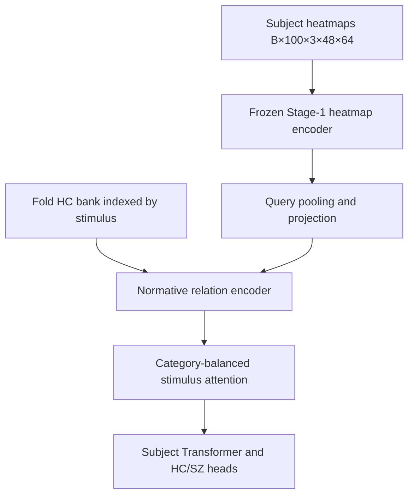

# EMS Stage 2 — HC-normative diagnostic subject classification

Repository root: `/root/EMS-Project`. This file is a static artifact: the
README generator was removed after generation by explicit user request, so
facts below (CLI help, hyperparameters, ablations) are snapshots at the time
of writing. After any code/config/registry change, update the affected
sections manually.

## 1. Title and scope

Stage 2 classifies subjects as Healthy Control (HC) or Schizophrenia (SZ)
using:

- a **transferred Stage-1 heatmap encoder** (frozen in the base model);
- a **fold-specific HC normative bank** indexed by stimulus;
- **stimulus-level normative relation features** between the learned query
  projection and the matched bank statistics;
- **category-balanced stimulus attention** and subject aggregation;
- an optional **token-level normative semantic attention** branch.

Stage 2 does **not** run DINO or Stage-1 semantic fusion for a query subject.
The query path uses only the heatmap encoder; the normative bank is a
precomputed Stage-1 artifact.

## 2. Dataset and split unit

Expected EMS dataset facts (validated against the actual manifests at
runtime — these counts are documentation, not a substitute for validation):

```text
160 subjects: 80 HC and 80 SZ
100 stimuli
15,912 available subject-stimulus trials
148 complete and 12 incomplete subjects
heatmap shape [3,48,64]
five subject-level folds
HC=0, SZ=1
```

The **subject — not the trial — is the independent classification and
evaluation unit**. All losses, metrics, bootstrap and confidence intervals
use subjects as the unit.

## 3. Stage-1 reuse boundary

| Reused | Not used on the Stage-2 query path |
|---|---|
| Heatmap encoder architecture | DINO features |
| Fold checkpoint `heatmap_encoder.*` weights | Stage-1 semantic adapter/fusion |
| Precomputed HC normative bank | Stage-1 decoder/pooling head |
| Checkpoint/config provenance | Cached query embeddings |

The base model freezes the transferred encoder; only the named
`unfreeze_last_block` ablation (Stage 2C) trains the final residual block at
0.1x the Stage-2 learning rate with an anchor loss.

## 4. HC normative-bank construction

For each outer fold:

1. load the approved fold-specific Stage-1 best checkpoint (SHA-256 pinned);
2. select training-HC contributors only;
3. run full, unmasked Stage-1 inference;
4. group outputs by `stimulus_index`;
5. accumulate means and diagonal population variances in float64;
6. save arrays, counts, contributor IDs, forbidden validation IDs and checksums;
7. build optional four-way crossfit training banks;
8. verify that no held-out subject contributed.

Canonical trial-bank shapes:

```text
mu_trial      [100,128]
sigma_trial   [100,128]
count_trial   [100]
```

Optional token-bank shapes:

```text
mu_token/sigma_token             [100,192,128]
mu_heat_token/sigma_heat_token   [100,192,128]   (not built — Phase-0 decision)
```

The Stage-1 trial embedding is post-fusion whereas the Stage-2 query comes
from the pre-fusion heatmap encoder. The base model therefore uses learned
query/bank projections and an alignment objective; raw subtraction between
query and bank is never presented as same-space evidence.

## 5. Architecture and tensor walkthrough



Base tensor table:

| Tensor | Shape | Meaning |
|---|---:|---|
| `heatmaps` | `[B,100,3,48,64]` | subject panel |
| flattened heatmaps | `[N,3,48,64]`, `N<=B*100` | available trials only |
| heat tokens | `[N,192,128]` | 12x16 row-major patches |
| query vector | `[N,128]` | learned Stage-2 pooling |
| matched bank mean/std | `[N,128]` each | same stimulus |
| relation input | `[N,770]` | query/bank/deviation/cosine features |
| trial embedding | `[B,100,128]` | scatter with missing mask |
| stimulus attention | `[B,100]` | category-balanced importance |
| subject embedding | `[B,128]` | contextual subject representation |
| main/aux logits | `[B]` each | subject-level predictions |

The optional token model adds token tensors `[B,100,192,128]` and semantic
patch maps `[B,100,12,16]`.

## 6. What "important stimulus" and "semantic information" mean

- `stimulus_attention`: normalized category-balanced selection weight;
- `stimulus_evidence`: signed local HC/SZ evidence;
- `stimulus_contribution = attention * evidence`;
- `normative_deviation`: reliability-weighted departure from the matched HC norm;
- `semantic_compatibility`: learned query–norm cosine compatibility;
- optional `semantic_patch_map`: token-level matched normative interaction.

Attention is an **attribution signal, not proof of causal importance**.
Recommended controls: fold/seed stability, leave-one-stimulus-out deletion
compared against category-matched random deletion, and subject-level
bootstrap confidence intervals.

## 7. Losses

| Component | Level | Purpose |
|---|---|---|
| `L_cls` | subject `[B]` | main subject BCE |
| `L_aux` | subject `[B]` | additive-evidence subject BCE |
| `L_trialmatch` | HC trials | matched query/bank alignment |
| `L_bankrank` | HC trials | matched versus wrong-stimulus margin |
| `L_tokenmatch` | HC trials (optional) | local token alignment |
| `L_cons` | subject | subset prediction consistency |
| `L_ent` | subject | early attention-collapse regularizer |
| `L_anchor` | encoder params (optional) | Stage-1 weight anchoring |

Starting total objective (base weights: aux 0.3,
match 0.1, cons 0.1,
entropy 0.01, anchor 0.0):

$$L_{total}=L_{cls}+0.3L_{aux}+0.1L_{match}
+0.1L_{cons}+0.01L_{ent}+\lambda_{anchor}L_{anchor}.$$

Loss weights are starting values; tune them only within the permitted
training/inner-validation data, never on the outer held-out fold.

## 8. Training phases

1. **Phase 2A** — HC-only bank alignment warm-up (10 epochs;
   `L_match` only; never eligible for best);
2. **Phase 2B** — HC/SZ diagnostic training (50 epochs;
   full objective; best-epoch selection with the ordered rule
   balanced accuracy -> AUROC -> lower val loss -> earlier epoch);
3. optional **final-block fine-tuning** (`unfreeze_last_block` ablation);
4. **calibration** from permitted non-test predictions only.

Validation scope: under `pilot_existing_stage1` (the approved Phase-0 regime)
per-epoch validation uses the outer fold and every output is labeled
`outer_fold_exploratory` — it is not a strict held-out estimate.
`strict_nested_stage1` is rejected: no Stage-1 checkpoint selected without
the outer held-out fold exists under the approved artifacts.

## 9. Training commands

```bash
# Bank verification (all five folds)
python build_stage2_normative_banks.py --fold all --verify-only

# Base verify-only / dry-run
python stage2_trainer.py --config configs/stage2/base.yaml --fold 0 --verify-only
python stage2_trainer.py --config configs/stage2/base.yaml --fold 0 --dry-run \
  --max-train-subjects 4 --max-val-subjects 4 --max-train-batches 1 --max-val-batches 1

# Explicitly marked smoke run (executed; not an experimental result)
python stage2_trainer.py --config configs/stage2/base.yaml --fold 0 --smoke \
  --max-train-subjects 4 --max-val-subjects 4 --max-train-batches 1 --max-val-batches 1 \
  --override optimization.alignment_epochs=0 --override optimization.classification_epochs=2

# Production training is the same command without the --max-* limits:
python stage2_trainer.py --config configs/stage2/base.yaml --fold 0
python stage2_trainer.py --config configs/stage2/base.yaml --fold all

# One named ablation (registry dry-run exercised for every runnable ablation)
python stage2_trainer.py --config configs/stage2/base.yaml --fold all --ablation no_bank
python -m stage2.ablations --fold 0 --dry-run-all

# Exact resume / weight-only initialization
python stage2_trainer.py --resume outputs/stage2/<run_id>/fold_0/checkpoints/last_stage2_fold0.pt
python stage2_trainer.py --load-stage2-weights outputs/stage2/<run_id>/fold_0/checkpoints/best_stage2_fold0.pt

# Stage-2 tests
python -m pytest tests/stage2 -q
```

Full CLI help:

```text
usage: stage2_trainer.py [-h] [--config CONFIG] [--fold FOLD]
                                 [--ablation ABLATION] [--seed SEED]
                                 [--evaluation-regime {pilot_existing_stage1,strict_nested_stage1}]
                                 [--stage1-checkpoint STAGE1_CHECKPOINT]
                                 [--bank-root BANK_ROOT]
                                 [--output-root OUTPUT_ROOT] [--resume RESUME]
                                 [--load-stage2-weights LOAD_STAGE2_WEIGHTS]
                                 [--device DEVICE] [--num-workers NUM_WORKERS]
                                 [--deterministic] [--dry-run] [--verify-only]
                                 [--smoke]
                                 [--max-train-subjects MAX_TRAIN_SUBJECTS]
                                 [--max-val-subjects MAX_VAL_SUBJECTS]
                                 [--max-train-batches MAX_TRAIN_BATCHES]
                                 [--max-val-batches MAX_VAL_BATCHES]
                                 [--override KEY=VALUE]

Stage-2 HC-normative subject classification trainer

options:
  -h, --help            show this help message and exit
  --config CONFIG
  --fold FOLD           {0,1,2,3,4,all}
  --ablation ABLATION
  --seed SEED
  --evaluation-regime {pilot_existing_stage1,strict_nested_stage1}
  --stage1-checkpoint STAGE1_CHECKPOINT
  --bank-root BANK_ROOT
  --output-root OUTPUT_ROOT
  --resume RESUME
  --load-stage2-weights LOAD_STAGE2_WEIGHTS
  --device DEVICE
  --num-workers NUM_WORKERS
  --deterministic
  --dry-run
  --verify-only
  --smoke               mark the run as a smoke run
  --max-train-subjects MAX_TRAIN_SUBJECTS
  --max-val-subjects MAX_VAL_SUBJECTS
  --max-train-batches MAX_TRAIN_BATCHES
  --max-val-batches MAX_VAL_BATCHES
  --override KEY=VALUE  dotted-key override applied after the ablation overlay
                        (repeatable)
```

## 10. Output layout and per-epoch history

```text
outputs/stage2/<run_id>/
├── config_resolved.yaml
├── environment.json
├── run_metadata.json
├── source_checksums.json
└── fold_0/
    ├── history.csv
    ├── epoch_commit.json
    ├── train.log
    ├── checkpoints/
    │   ├── best_stage2_fold0.pt
    │   └── last_stage2_fold0.pt
    ├── validation/
    │   ├── metrics.json
    │   ├── subject_predictions.parquet
    │   ├── stimulus_attributions.npz
    │   └── calibration.json
    └── audit/
        ├── bank_match_metrics.json
        ├── tensor_shapes.json
        └── leakage_checks.json
```

`history.csv` is atomically committed immediately after each epoch (checkpoint
-> history -> `epoch_commit.json`, all atomic + fsync). Columns:
`run_id`, `fold`, `epoch`, `phase_epoch`, `global_step`, `training_phase`, `validation_scope`, `eligible_for_best`, `is_best_epoch`, `best_epoch_so_far`, `learning_rate`, `encoder_learning_rate`, `learning_rate_min`, `learning_rate_max`, `weight_decay`, `lambda_aux`, `lambda_match`, `lambda_cons`, `lambda_entropy`, `lambda_anchor`, `train_loss`, `train_cls_loss`, `train_aux_loss`, `train_match_loss`, `train_trialmatch_loss`, `train_bankrank_loss`, `train_tokenmatch_loss`, `train_cons_loss`, `train_entropy_loss`, `train_anchor_loss`, `val_loss`, `val_cls_loss`, `val_aux_loss`, `val_match_loss`, `val_cons_loss`, `train_accuracy`, `train_balanced_accuracy`, `val_accuracy`, `val_balanced_accuracy`, `val_auroc`, `val_f1`, `val_sensitivity`, `val_specificity`, `val_brier`, `train_attention_entropy`, `val_attention_entropy`, `train_matched_cosine`, `train_wrong_cosine`, `val_matched_cosine`, `val_wrong_cosine`, `bank_rank_accuracy`, `grad_norm_mean`, `grad_norm_max`, `grad_clip_fraction`, `optimizer_step_count`, `skipped_optimizer_step_count`, `num_train_subjects`, `num_val_subjects`, `num_train_trials`, `num_val_trials`, `n_train_batches`, `n_val_batches`, `nonfinite_batch_count`, `epoch_time_seconds`, `peak_gpu_memory_mb`, `seed`.

`best` and `last` checkpoints are independent files; exact resume restores
model, optimizer, scheduler, scaler, RNG, sampler and best-rule state and is
rejected on any fold/config/ablation/checksum mismatch. Weight-only
initialization (`--load-stage2-weights`) starts a fresh optimizer, scheduler
and history.

## 11. Ablation table

Base-comparison variants reference `base`; `single_token_attention` and
`no_spatial_bridge` are child ablations of `token_bank_serial_attention`;
negative controls are marked.

| Name | Scientific question | Reference | Changed keys | Required bank artifact | Kind | Example command |
|---|---|---|---|---|---|---|
| `base` | Full trial-bank model | base | none | trial_bank | variant | `python stage2_trainer.py --config configs/stage2/base.yaml --fold all --ablation base` |
| `no_bank` | Does normative information add value? | base | `model.bank_features_active` | none | negative control | `python stage2_trainer.py --config configs/stage2/base.yaml --fold all --ablation no_bank` |
| `wrong_stimulus_bank` | Is stimulus matching important? | base | `model.wrong_bank_permutation` | trial_bank | negative control | `python stage2_trainer.py --config configs/stage2/base.yaml --fold all --ablation wrong_stimulus_bank` |
| `global_bank` | Is per-stimulus normalization important? | base | `model.global_bank` | trial_bank | negative control | `python stage2_trainer.py --config configs/stage2/base.yaml --fold all --ablation global_bank` |
| `random_encoder` | Do transferred Stage-1 heatmap features add value? | base | `model.encoder_random_init` | trial_bank | negative control | `python stage2_trainer.py --config configs/stage2/base.yaml --fold all --ablation random_encoder` |
| `unfreeze_last_block` | Does limited encoder adaptation help? | base | `model.encoder_unfreeze_last_block`, `loss.lambda_anchor` | trial_bank | variant | `python stage2_trainer.py --config configs/stage2/base.yaml --fold all --ablation unfreeze_last_block` |
| `mean_query_pooling` | Does learned patch pooling help? | base | `model.query_pooling` | trial_bank | variant | `python stage2_trainer.py --config configs/stage2/base.yaml --fold all --ablation mean_query_pooling` |
| `no_category_balance` | Does category balancing prevent count dominance? | base | `model.category_balanced_attention` | trial_bank | variant | `python stage2_trainer.py --config configs/stage2/base.yaml --fold all --ablation no_category_balance` |
| `mean_subject_pooling` | Does inter-stimulus contextualization help? | base | `model.subject_transformer_layers` | trial_bank | variant | `python stage2_trainer.py --config configs/stage2/base.yaml --fold all --ablation mean_subject_pooling` |
| `no_match_loss` | Is explicit query/bank alignment useful? | base | `loss.lambda_match`, `optimization.alignment_epochs` | trial_bank | variant | `python stage2_trainer.py --config configs/stage2/base.yaml --fold all --ablation no_match_loss` |
| `no_aux_loss` | Does faithful additive evidence supervision help? | base | `loss.lambda_aux` | trial_bank | variant | `python stage2_trainer.py --config configs/stage2/base.yaml --fold all --ablation no_aux_loss` |
| `no_consistency_loss` | Does subset consistency improve robustness? | base | `loss.lambda_cons`, `subsets.enabled` | trial_bank | variant | `python stage2_trainer.py --config configs/stage2/base.yaml --fold all --ablation no_consistency_loss` |
| `no_attention_entropy` | Does early attention regularization help? | base | `loss.lambda_entropy` | trial_bank | variant | `python stage2_trainer.py --config configs/stage2/base.yaml --fold all --ablation no_attention_entropy` |
| `token_bank_serial_attention` | Does local normative semantic structure add value? | base | `model.bank_mode`, `bank.require_fused_token_bank` | fused_token_bank | variant | `python stage2_trainer.py --config configs/stage2/base.yaml --fold all --ablation token_bank_serial_attention` |
| `single_token_attention` | Are two serial token layers necessary? | token_bank_serial_attention | `model.bank_mode`, `bank.require_fused_token_bank`, `model.token_attention_layers` | fused_token_bank | token child | `python stage2_trainer.py --config configs/stage2/base.yaml --fold all --ablation single_token_attention` |
| `no_spatial_bridge` | Does spatial token propagation add value? | token_bank_serial_attention | `model.bank_mode`, `bank.require_fused_token_bank`, `model.token_spatial_bridge` | fused_token_bank | token child | `python stage2_trainer.py --config configs/stage2/base.yaml --fold all --ablation no_spatial_bridge` |
| `same_space_heat_bank` | Is direct same-encoder token deviation sufficient? | base | `model.bank_mode`, `bank.require_heatmap_token_bank` | heatmap_token_bank | variant | `python stage2_trainer.py --config configs/stage2/base.yaml --fold all --ablation same_space_heat_bank` |

## 12. Reproducibility and leakage safeguards

- subject-level folds, batching and metrics;
- contributor/forbidden-ID bank audit (`audit/leakage_checks.json`);
- crossfit bank assignment (a training HC never receives a bank it built);
- fixed Stage-1 checkpoint and bank checksums (SHA-256, verified at load);
- deterministic validation (fixed order, fixed subset masks, inference mode);
- config hash (key-order invariant) and source checksums recorded per run;
- seeds captured and restored on exact resume (bit-identical continuation);
- `pilot_existing_stage1` results labeled `outer_fold_exploratory`.

## 13. Troubleshooting

- **Missing/ambiguous Stage-1 checkpoint**: the registry
  `configs/stage2/stage1_checkpoints.yaml` maps each fold to exactly one
  SHA-pinned checkpoint; no automatic fallback exists.
- **Bank/checkpoint hash mismatch**: any SHA-256 mismatch aborts the run;
  rebuild the bank or update the registry deliberately.
- **Absent token bank for a token ablation**: token ablations fail at
  initialization ("no fused token banks").
- **Wrong stimulus manifest/order**: manifests must match the processed/DINO
  order; verification fails with an explicit error.
- **One-class metric warning**: AUROC/balanced accuracy are stored as `null`
  with a warning, never substituted with zero.
- **Non-finite loss/gradient**: training stops hard and writes
  `run_failure.json`; batches are never silently skipped.
- **History/checkpoint mismatch on resume**: checkpoint ahead of history
  triggers deterministic repair; history ahead of the checkpoint is refused
  as corrupted state (never truncated).
- **Out-of-memory token maps**: full per-head attention is retained only under
  an explicit debug flag; reduced maps are `[B,100,12,16]`.
- **Incomplete subject panels**: missing trials are masked and excluded from
  every softmax and loss.
- **README out of sync with code**: this README is a static snapshot — after
  any code/config/registry change, update the affected sections manually.
