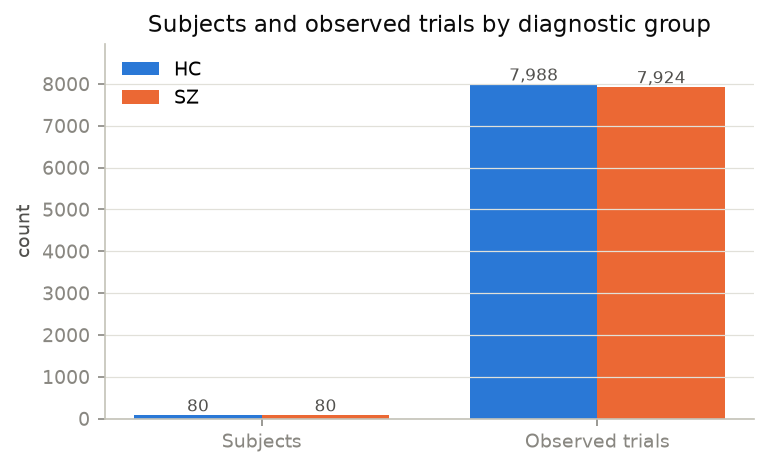
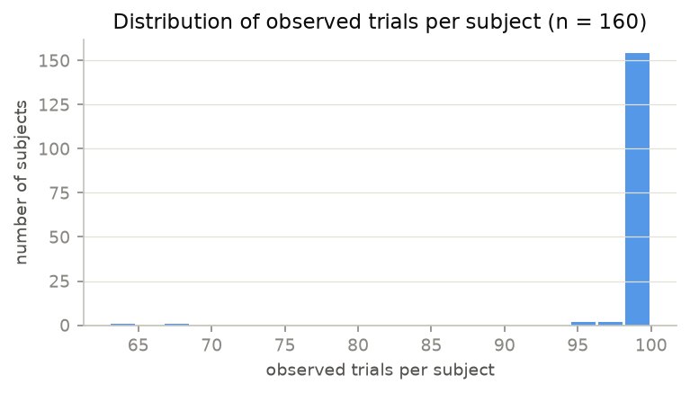
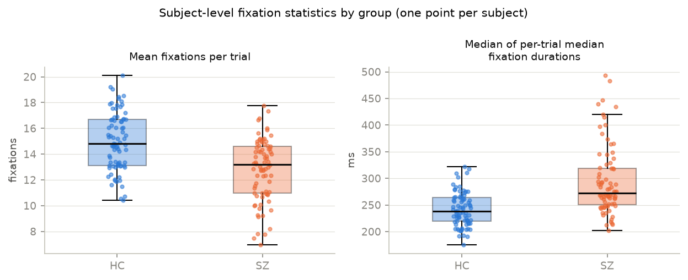
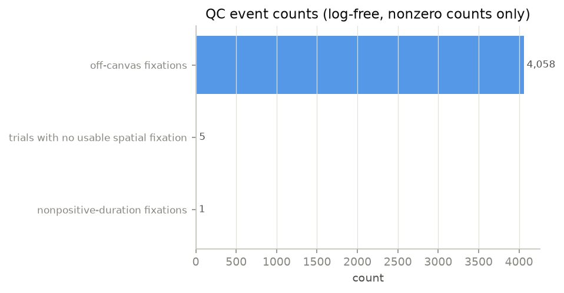
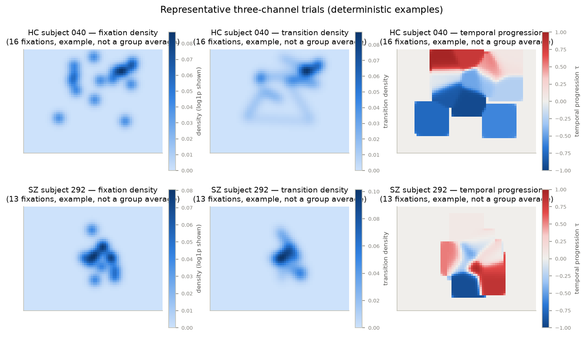
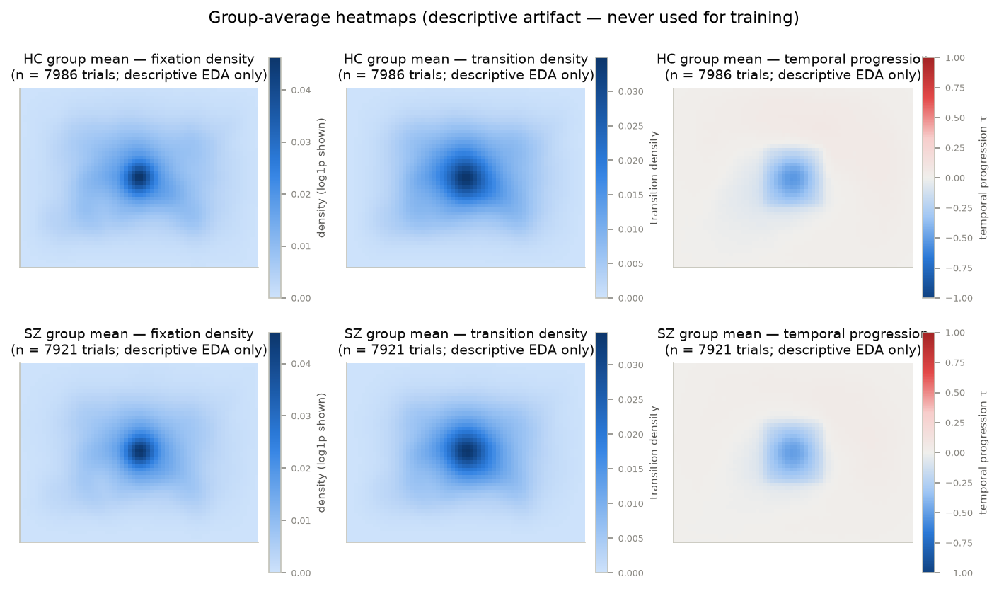

# EMS processed dataset — preprocessing, schema, and EDA

Generated reproducibly from the canonical processed artifacts by:

```bash
generate_preprocessed_readme.py --processed-root /root/EMS-Project/processed_dataset --output-dir /root/EMS-Project/readme/preprocessed
```

Python 3.12.3, NumPy 2.5.2, pandas 3.0.5.

## 1. Purpose and provenance

The processed dataset under `/root/EMS-Project/processed_dataset` is a
**deterministic cache** for later modeling stages (DINO features, five-fold
subject CV, Stage-1 training). It is built from raw EMS fixation-event
workbooks under `original_dataset/EMS/All_Data/Fixations` and stimulus images
under `original_dataset/EMS/Images`; **the original dataset is never
modified**.

The cache contains **no fitted model, no CV statistics, no normative bank,
and no population normalization**. Preprocessing operates on individual
trials only.

Generating configuration:

- preprocessing config SHA-256: `b67c11ab35326730041e1541b282a94a8820c49f35c069cc7206edcc5ce9839a`
- resolved config hash: `554ed2cb8817ddd1286e89b6b935059e80b2d2b3456e793b11756e5b49826660` (seed 2026)
- source inventory / dataset metadata checksums are recorded in
  `source_inventory.json` and `dataset_metadata.json`

## 2. Directory and file schema

```text
processed_dataset/
├── dataset_metadata.json        # completion record (written last; readers require it)
├── preprocessing_config.json    # fully resolved configuration
├── source_inventory.json        # image/subject SHA-256 inventory + anomaly measurements
├── image_manifest.csv           # stimulus_index, stimulus_id, source_image_name, category,
│                                #   relative_image_path, width, height, sha256
├── subject_manifest.csv         # subject_id, subject_numeric_id, group, label, source_workbook,
│                                #   n_fixation_rows, n_trials, n_missing_expected_stimuli, source_sha256
├── trial_manifest.parquet       # trial_uid, subject_id, stimulus_id, subject_numeric_id,
│                                #   stimulus_index, group, label, category, subject_array_path,
│                                #   subject_row_index, n_fixations_raw, n_fixations_used,
│                                #   n_transitions_used, total_duration_ms_raw, total_duration_ms_used,
│                                #   n_off_canvas, n_nonfinite, n_nonpositive_duration,
│                                #   n_below_duration_threshold, fix_index_has_gap, qc_status
├── trial_manifest.csv           # optional human-readable export
├── qc_summary.json              # global QC counts + excluded-trial list
└── subjects/
    └── <subject_id>/            # canonical string ID with leading zeros ("000", "203")
        ├── heatmaps.npy         # float32 [n_subject_trials, 3, 48, 64]
        ├── stimulus_indices.npy # int64 [n_subject_trials], ascending stimulus_index order
        ├── trial_qc.parquet     # per-trial QC incl. mass and median-duration columns
        └── artifact_meta.json   # config hash, source checksum, array checksums
```

Identifier rules: `subject_id` is the workbook stem with leading zeros
preserved and is never an array offset; `stimulus_index` is a contiguous
integer assigned only through `image_manifest.csv` (ordered by category, then
basename); the trial key is `(subject_id, stimulus_id)` with a SHA-256-derived
`trial_uid`. The pair `(subject_array_path, subject_row_index)` retrieves the
exact array row for a trial.

Minimal retrieval example:

```python
import sys
sys.path.insert(0, "/root/EMS-Project/src")
from preprocessing.storage import TrialStore

store = TrialStore("/root/EMS-Project/processed_dataset")
record = store.get_trial(subject_id="000", stimulus_id="outman_054.jpg")
print(record.heatmap.shape)   # (3, 48, 64) float32
print(record.group)           # 'HC'
```

## 3. Exact channel definitions

Heatmaps are `float32 [3, 48, 64]` with this immutable channel order:

| channel | content | stored range |
|---|---|---|
| 0 | fixation density | ≥ 0, mass ≈ number of used fixations |
| 1 | consecutive-fixation transition density | ≥ 0, mass ≈ number of used transitions |
| 2 | temporal progression τ | approximately [−1, 1] |

Coordinate transform for an accepted fixation `(x, y)` on the
1024 × 768 canvas:

```text
u = x * (W − 1) / (1024 − 1)      v = y * (H − 1) / (768 − 1)      W = 64, H = 48
```

Event filtering policy: off-canvas fixations are excluded from spatial maps
(policy `drop`) but keep their QC counts; fixations with
nonpositive duration are dropped (`min_fix_duration_ms=0.0`,
`drop_nonpositive_duration=True`); trials with no
usable spatial fixation are recorded with
`qc_status = "excluded_no_spatial_fixations"` and have **no heatmap row**.

Channel 0: H_F = Σᵢ Gᵢ, one unit-mass truncated Gaussian per used fixation
(σ = 2.0 cells, truncation 4.0σ,
border-truncated kernels renormalized to unit sum). Mass is deliberately **not**
normalized to one or to any group statistic.

Channel 1: for every consecutive pair in original `FIX_INDEX` order with both
endpoints spatially valid, the segment is rasterized with sub-cell sampling
(max spacing 0.5 cells), normalized to unit
mass, and Gaussian-smoothed. Rejected intermediate fixations are never
bridged; zero-length transitions deposit unit mass at their endpoint.

Channel 2: with no timestamps available, elapsed time is reconstructed from
fixation durations. For duration-valid events in original order (off-canvas
events advance the clock but deposit nothing):

```text
tᵢᵐⁱᵈ = (Σ_{k<i} d_k + dᵢ/2) / Σ_k d_k        τᵢ = 2 tᵢᵐⁱᵈ − 1
H_P(u,v) = Σᵢ τᵢ Gᵢ(u,v) / (H_F(u,v) + ε)
```

Unvisited locations are exactly zero. See
`src/preprocessing/heatmaps.py` for the implementation.

## 4. Population and trial inventory

Measured from the processed artifacts:

- **Subjects**: 160 (HC: 80, SZ: 80)
- **Stimuli**: 100 images — Manipulated Images: 32, Natural Scenes: 31, Social Scenes: 22, Synthetic Images: 15
- **Fixation rows**: 225,159
- **Observed trials**: 15,912 (15,907 heatmap-eligible; 5 excluded)
- **Trials per subject**: min 63, max 100, mean 99.5
- **Fixations per trial**: min 1, median 14.0, max 39
- **Total positive fixation duration per trial**: median 4220 ms, mean 4132 ms
- **Subjects with missing stimuli** (12):
- `216`: 63 trials observed (37 of 100 stimuli missing)
- `259`: 68 trials observed (32 of 100 stimuli missing)
- `064`: 96 trials observed (4 of 100 stimuli missing)
- `020`: 96 trials observed (4 of 100 stimuli missing)
- `244`: 97 trials observed (3 of 100 stimuli missing)
- `013`: 98 trials observed (2 of 100 stimuli missing)
- `019`: 99 trials observed (1 of 100 stimuli missing)
- `066`: 99 trials observed (1 of 100 stimuli missing)
- `240`: 99 trials observed (1 of 100 stimuli missing)
- `251`: 99 trials observed (1 of 100 stimuli missing)
- `270`: 99 trials observed (1 of 100 stimuli missing)
- `271`: 99 trials observed (1 of 100 stimuli missing)
- **QC event counts**: off-canvas rows 4,058;
  nonpositive durations 1;
  below-threshold rows 0;
  non-finite/malformed cells 0;
  FIX_INDEX gaps/duplicates/non-monotonic 0/0/0
- **Excluded or warning-status trials**: 5
  (zero usable spatial fixations after the approved policy)

## 5. Heatmap-channel statistics

Computed over every stored heatmap cell (float32, `[3, 48, 64]` per trial):

| channel | dtype | shape | min | max | mean | std | quantiles | finite |
|---|---|---|---|---|---|---|---|---|
| 0 | float32 | [3, 48, 64] | 0.000 | 1.126 | 0.0045 | 0.0151 | q01 0.0000 / q50 0.0021 / q99 0.1054 | 1.000000 |
| 1 | float32 | [3, 48, 64] | 0.000 | 1.100 | 0.0042 | 0.0136 | q01 0.0000 / q50 0.0023 / q99 0.0899 | 1.000000 |
| 2 | float32 | [3, 48, 64] | -1.000 | 0.999 | -0.0117 | 0.3292 | q01 -0.9400 / q50 0.0000 / q99 0.9300 | 1.000000 |

Per-trial total mass:

- Channel 0 (fixation density): min 1.0, median 14.0, max 39.0
- Channel 1 (transition density): min 0.0, median 13.0, max 38.0
- Channel 2: fraction of nonzero cells 0.3736; range -0.9997…0.9990

Mass-consistency (expected vs observed):

- Channel 0: mean |H_F − n_fixations_used| = 1.55e-07, max = 3.81e-06 over 15,907 trials
- Channel 1: mean |H_T − n_transitions_used| = 1.60e-07, max = 3.81e-06 over 15,907 trials

## 6. Basic HC/SZ EDA (descriptive)

Every comparison is aggregated to **one value per subject** first; trials are
never treated as independent clinical samples.

- **mean fixations per trial** (unit: subject): HC n = 80, median = 14.81; SZ n = 80, median = 13.20; Mann–Whitney U = 4674.5, p = 4.90e-07, rank-biserial r = -0.461 (r > 0 ⇒ HC subject-level median larger)
- **median of per-trial median fixation durations (ms)** (unit: subject): HC n = 80, median = 238.75; SZ n = 80, median = 272.00; Mann–Whitney U = 1433.0, p = 1.65e-09, rank-biserial r = 0.552 (r > 0 ⇒ HC subject-level median larger)
- **mean fixation duration (ms)** (unit: subject): HC n = 80, median = 272.39; SZ n = 80, median = 311.60; Mann–Whitney U = 1729.0, p = 5.21e-07, rank-biserial r = 0.460 (r > 0 ⇒ HC subject-level median larger)
- **total fixation duration (ms)** (unit: subject): HC n = 80, median = 410440.50; SZ n = 80, median = 419229.50; Mann–Whitney U = 2838.0, p = 0.2173, rank-biserial r = 0.113 (r > 0 ⇒ HC subject-level median larger)
- **mean fixation-density mass per trial** (unit: subject): HC n = 80, median = 14.81; SZ n = 80, median = 13.20; Mann–Whitney U = 4676.0, p = 4.77e-07, rank-biserial r = -0.461 (r > 0 ⇒ HC subject-level median larger)
- **mean transition-density mass per trial** (unit: subject): HC n = 80, median = 13.66; SZ n = 80, median = 11.99; Mann–Whitney U = 4666.0, p = 5.70e-07, rank-biserial r = -0.458 (r > 0 ⇒ HC subject-level median larger)
- **mean fixation-map spatial entropy (nats)** (unit: subject): HC n = 80, median = 6.01; SZ n = 80, median = 5.77; Mann–Whitney U = 4885.0, p = 9.00e-09, rank-biserial r = -0.527 (r > 0 ⇒ HC subject-level median larger)
- **mean center-of-mass distance from map center (cells)** (unit: subject): HC n = 80, median = 5.70; SZ n = 80, median = 6.03; Mann–Whitney U = 2725.0, p = 0.1054, rank-biserial r = 0.148 (r > 0 ⇒ HC subject-level median larger)

- Unit of analysis: subject (one value per subject); trials are never treated as independent clinical samples.
- rank_biserial_r > 0 means the HC subject-level median is larger.
- These comparisons are descriptive; no multiple-comparison correction is applied and no diagnostic validity is claimed.

## 7. Caveats

- Subject and stimulus identifiers are non-contiguous; array positions must
  be resolved through manifests, never by ID magnitude.
- 15,912 observed trials instead of a complete
  160 × 100 rectangle; missing trials remain missing everywhere downstream.
- No timestamps or raw gaze samples exist; fixation order and duration are the
  only temporal information, so the temporal channel is a reconstructed clock.
- Viewing duration is right-censored by trial end; total durations are
  observational aggregates, not exposure times.
- Pupil units are unknown and unvalidated (`FIX_PUPIL` is retained in QC only).
- Off-canvas and short-duration events are handled by the approved policies
  and counted in QC; the kernel σ = 2.0 and the
  duration threshold are ablation candidates.
- The five excluded trials, the two substantially incomplete subjects
  (`216`, `259`), and the descriptive group differences above do **not**
  establish diagnostic validity. Stage-1 modeling is HC-only and does not
  consume the SZ comparisons shown here.

## Figures



*Figure 1 — Subjects and observed trials by diagnostic group.*


*Figure 2 — Distribution of observed trials per subject.*


*Figure 3 — Subject-level fixation count and median duration by group (one point per subject).*


*Figure 4 — QC event counts.*


*Figure 5 — Deterministically selected example trials (one HC, one SZ); examples, not group averages.*


*Figure 6 — Group-average heatmaps; descriptive EDA artifact, never used for model training.*
